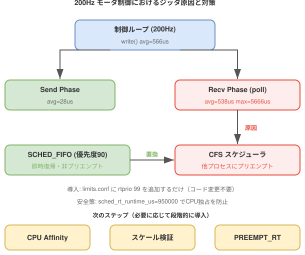

# Jetson Orin上のROS 2リアルタイム制御でSCHED_FIFOを導入してジッタを抑える

## はじめに

ROS 2の`ros2_control`で200Hzのモータ制御ループを回していると，「平均レイテンシは十分なのに，たまに数msのスパイクが出る」という現象に悩まされることがあります．これはLinuxのデフォルトスケジューラ（CFS: Completely Fair Scheduler）が制御スレッドをプリエンプトすることが主な原因です．

本記事では，Jetson Orin Nano Super上でRobStrideモータの制御ループを題材に，SCHED_FIFOの導入によってジッタを改善する方法を解説します．コード変更は不要で，環境設定のみで導入できます．

## 前提条件

- **ハードウェア**: NVIDIA Jetson Orin Nano Super（6コア ARM）
- **OS**: JetPack / L4T（Ubuntu 22.04ベース）
- **ミドルウェア**: ROS 2（`ros2_control` + `controller_manager`）
- **制御対象**: RobStrideモータ（CAN通信，200Hz制御ループ）
- **読者に求める知識**: Linuxのプロセススケジューリングの基礎，ROS 2の基本操作

## 問題 — CFS環境でのジッタスパイク

### 計測結果

1台のモータを200Hzで制御した際の`write()`サイクル時間を14ウィンドウ（各200サイクル = 1秒）にわたって計測した結果が以下です．

| 指標 | 値 | 判定 |
|------|-----|------|
| 平均サイクル時間 | 566 us | 良好（5msバジェットの11%） |
| 最大サイクル時間 | 5,692 us | NG（5ms超） |
| 標準偏差 | 128 us | 許容範囲 |
| 応答欠落率 | 0 / 2,800 | 完璧 |

平均566usは200Hz（= 5,000us周期）に対して十分余裕がありますが，最大値が5,692usに達しており，周期オーバーランの可能性があると判定されました．

### 内訳分析

送信（send）と受信（recv）のフェーズに分解すると，スパイクの原因が明確になります．

| フェーズ | 平均 | 最大 |
|----------|------|------|
| Send | 28 us | 642 us |
| Recv | 538 us | 5,666 us |

**受信フェーズが律速**です．CAN応答を`poll()`で待つ間にカーネルのCFSスケジューラが制御スレッドをプリエンプトし，数ms規模の遅延が発生していました．

### ウィンドウ別の傾向

```
# 1  avg=  528  max=  887   ██
# 2  avg=  533  max=  842   ██
# 3  avg=  538  max=  749   ██
# 4  avg=  578  max= 5692   ██  ← 最大スパイク
# 5  avg=  572  max= 3468   ██
# 6  avg=  554  max=  794   ██
# 7  avg=  592  max= 1776   ██
# 8  avg=  569  max= 1756   ██
# 9  avg=  587  max= 2062   ██
#10  avg=  579  max= 1791   ██
#11  avg=  583  max= 1693   ██
#12  avg=  584  max= 1663   ██
#13  avg=  554  max= 1149   ██
#14  avg=  575  max=  833   ██
```

2,800サイクル中の大部分は1ms以下で完了しますが，200サイクルに1回程度のペースで1ms超のスパイクが発生し，稀に（2,800サイクル中1回）5ms超に達します．

## 原因 — なぜCFSではジッタが生じるのか



Linux標準のCFS（Completely Fair Scheduler）は「すべてのプロセスに公平にCPU時間を配分する」ことを目的としたスケジューラです．これはデスクトップやサーバ用途では理想的ですが，リアルタイム制御では以下の問題を引き起こします．

### CFS環境での問題

1. **プリエンプション**: 制御スレッドがCAN応答を`poll()`で待っている間に，カーネルが他のプロセス（ROS 2ノード，ログ出力，システムデーモン等）にCPU時間を割り当てる
2. **スケジューリング遅延**: `poll()`がCAN応答の到着を検知しても，CFSの判断で制御スレッドへの復帰が数百us〜数ms遅れる
3. **非決定的挙動**: スパイクの発生タイミングは他プロセスの負荷に依存し，予測できない

### SCHED_FIFOによる解決

`SCHED_FIFO`はLinuxのリアルタイムスケジューリングポリシーの一つで，以下の特性を持ちます．

- **絶対優先**: SCHED_FIFOスレッドは，通常のCFSスレッドよりも常に優先される
- **非プリエンプト**: 同一優先度のSCHED_FIFOスレッドは，自発的にCPUを手放すまでプリエンプトされない
- **即時復帰**: `poll()`等のブロッキング呼び出しから戻った際に，即座にスケジュールされる

これにより，CAN応答到着後のスケジューリング遅延がほぼゼロになり，スパイクが大幅に抑制されます．

## 導入手順 — コード変更なしで有効化する

`ros2_control`の`controller_manager`は，設定ファイルの`thread_priority`パラメータを読み取り，自動的にSCHED_FIFOを適用する機能を持っています．

### ステップ1: 設定の確認

`controller_manager`の設定でリアルタイム優先度が指定されていることを確認します．

```yaml
# controllers.yaml
controller_manager:
  ros__parameters:
    update_rate: 200
    thread_priority: 90        # SCHED_FIFO priority
```

この設定が既に存在していれば，コード側の準備は完了しています．

### ステップ2: カーネルの安全機構を確認

SCHED_FIFOスレッドがCPUを独占してシステムがハングするリスクを防ぐため，Linuxカーネルにはセーフティネットがあります．

```bash
cat /proc/sys/kernel/sched_rt_runtime_us
# 期待値: 950000
```

`950000`（= 950ms/1s）は，RTスレッドが1秒あたり最大950msまでしかCPUを占有できないことを意味します．残りの50msは通常プロセスに確保されるため，RTスレッドにバグがあってもシステムが完全にハングすることはありません．

この値がUbuntu/L4Tのデフォルトで設定されていることを確認してください．

### ステップ3: RT権限の付与

SCHED_FIFOを使用するには，実行ユーザにリアルタイムスケジューリングの権限が必要です．

```bash
# /etc/security/limits.conf に追加
sudo sh -c 'echo "<username> - rtprio 99" >> /etc/security/limits.conf'
sudo sh -c 'echo "<username> - memlock unlimited" >> /etc/security/limits.conf'
```

`<username>`は実際のユーザ名に置き換えてください．設定後，**再ログイン**（SSHの場合は切断→再接続）が必要です．

### ステップ4: 設定の反映確認

```bash
# 再ログイン後に確認
ulimit -r
# 期待値: 99
```

`99`が返ればSCHED_FIFOの使用権限が付与されています．この状態で`ros2_control`を起動すれば，`controller_manager`が自動的にSCHED_FIFO（優先度90）を適用します．

## リスクと安全策

SCHED_FIFOの導入にはメリットだけでなく，考慮すべきリスクもあります．

| リスク | 深刻度 | 説明 | 対策 |
|--------|--------|------|------|
| バグによるCPU独占 | 中 | SCHED_FIFOスレッドが無限ループに入るとシステムがハングする可能性 | `sched_rt_runtime_us`のデフォルト値（950000）で緩和済み |
| 他プロセスの飢餓 | 低 | RT優先度90のスレッドが走行中は通常プロセスがプリエンプトされる | Jetson Orin Nano Superは6コアあり，影響は限定的 |
| デバッグ困難 | 低 | ハング時にdmesgやログが取得しにくい | `sched_rt_runtime_us`で完全ハングを防止 |

`sched_rt_runtime_us = 950000`がデフォルトで有効であれば，実質的なリスクは非常に低いといえます．

## スケール検証 — 5モータ構成でのSCHED_FIFO効果

1モータでの改善効果を確認した後，5モータ・1バス（CAN）構成でスケール検証を行いました．

### 計測条件

- **モータ数**: 5台（CAN ID 21〜25，同一バス）
- **制御周波数**: 200Hz
- **計測ウィンドウ**: 各1,000サイクル（= 5秒），約130秒間

### CFS（適用前）の計測結果

| 指標 | 値 | 判定 |
|------|-----|------|
| 平均サイクル時間 | 1,620 us | 良好（5msバジェットの32%） |
| 最大サイクル時間 | 11,378 us | NG（5ms超） |
| 標準偏差 | 179 us | — |
| ウィンドウ間の安定性 | stddev of avgs = 23 us | — |
| 応答欠落率 | 0 / 28,000 | 完璧 |

1モータ時（avg 566us, max 5,692us）と比較して，5モータではサイクル時間の平均が約3倍に増加しています．これはCAN応答を5台分順次受信するためです．最大値は11,378usに悪化し，5ms周期を大きく超過しました．

```
# 3  avg= 1650  max= 9184   ██████  ← スパイク
# 6  avg= 1644  max=10784   ██████  ← スパイク
#27  avg= 1649  max=11378   ██████  ← 最大スパイク
```

28ウィンドウ中3回で5ms超のスパイクが発生しており，200Hz制御として**問題あり**と判定されました．

### SCHED_FIFO（適用後）の計測結果

| 指標 | 値 | 判定 |
|------|-----|------|
| 平均サイクル時間 | 1,588 us | 良好（5msバジェットの32%） |
| 最大サイクル時間 | 1,943 us | OK（5ms以内） |
| 標準偏差 | 16.9 us | — |
| ウィンドウ間の安定性 | stddev of avgs = 10 us | — |
| 応答欠落率 | 0 / 26,000 | 完璧 |

全26ウィンドウで最大値が2ms以内に収まり，5ms超のスパイクは**ゼロ**になりました．

### 比較

| 指標 | CFS（適用前） | SCHED_FIFO（適用後） | 改善 |
|------|--------------|---------------------|------|
| 平均サイクル時間 | 1,620 us | 1,588 us | −2% |
| 最大サイクル時間 | 11,378 us | 1,943 us | **−83%** |
| 標準偏差 | 179 us | 16.9 us | **−91%** |
| 5ms超スパイク | 3回 / 28ウィンドウ | 0回 / 26ウィンドウ | **解消** |
| 判定 | NG | OK | — |

平均値にはほぼ差がない（32us）一方で，**最大値が約5.8倍改善**，**標準偏差が約10倍改善**しています．SCHED_FIFOの効果はテールレイテンシの安定化に集中しており，5モータ構成でも200Hz安定動作が確認されました．

### 送受信の内訳比較

| フェーズ | CFS avg / max | SCHED_FIFO avg / max |
|----------|--------------|---------------------|
| Send | 77 us / 1,039 us | 59 us / 202 us |
| Recv | 1,544 us / 11,288 us | 1,529 us / 1,827 us |

1モータ時と同様に，**受信フェーズのスパイクがSCHED_FIFOによってほぼ解消**されています．送信フェーズのmax値も1,039us → 202usに改善しており，送信中のプリエンプションも抑制されていることがわかります．

## 次のステップ — CPU affinityとバス分散

5モータ・1バス構成でのSCHED_FIFO効果を確認しました．さらなる最適化が必要になった場合の検討ポイントは以下の通りです．

1. **2バス構成によるバス分散**: 現在は1バスに5モータを接続しているため，受信フェーズが順次処理になっている．2バスに分散し並列受信することで，サイクル時間の平均値自体を削減できる可能性がある
2. **CPU affinity（コア固定）の導入**: SCHED_FIFOと組み合わせて制御スレッドを専用コアにピン留めすることで，キャッシュミスやコア間マイグレーションを防ぐ
3. **PREEMPT_RTカーネルの検討**: さらに厳密なリアルタイム保証が必要な場合は，PREEMPT_RTパッチ済みカーネルの導入を検討する

現時点ではSCHED_FIFOのみで200Hz安定動作を達成しているため，これらの対策はモータ数の増加や制御周波数の引き上げ時に再評価する予定です．

## まとめ

- `ros2_control`の200Hzモータ制御で，**平均566usに対し最大5,692usのジッタスパイク**が発生していた（1モータ構成）
- 原因は**Linuxの標準スケジューラ（CFS）による受信フェーズのプリエンプション**
- `SCHED_FIFO`は**`/etc/security/limits.conf`への1行追加のみ**で導入でき，コード変更は不要
- `sched_rt_runtime_us`のデフォルト値がセーフティネットとして機能し，**導入リスクは実質的に低い**
- 5モータ・1バス構成でのスケール検証において，**最大レイテンシが11,378us → 1,943usに改善**（−83%），**標準偏差が179us → 17usに改善**（−91%）し，200Hz安定動作を確認

## おわりに

SCHED_FIFOの導入は，リアルタイム制御の改善としては最もコストパフォーマンスの高い施策の一つです．「RTカーネルを入れないとダメ」と思われがちですが，多くのケースではまず標準カーネル上でSCHED_FIFOを有効化するだけで十分な改善が得られます．

本記事の計測結果は，BSL-DroidプロジェクトのRobStrideモータ制御パッケージ（`aoba_hardware`）で取得したものです．1モータおよび5モータ構成の双方でSCHED_FIFOの効果を確認しており，今後はバス分散やCPU affinityなどの追加最適化を必要に応じて検討していきます．
