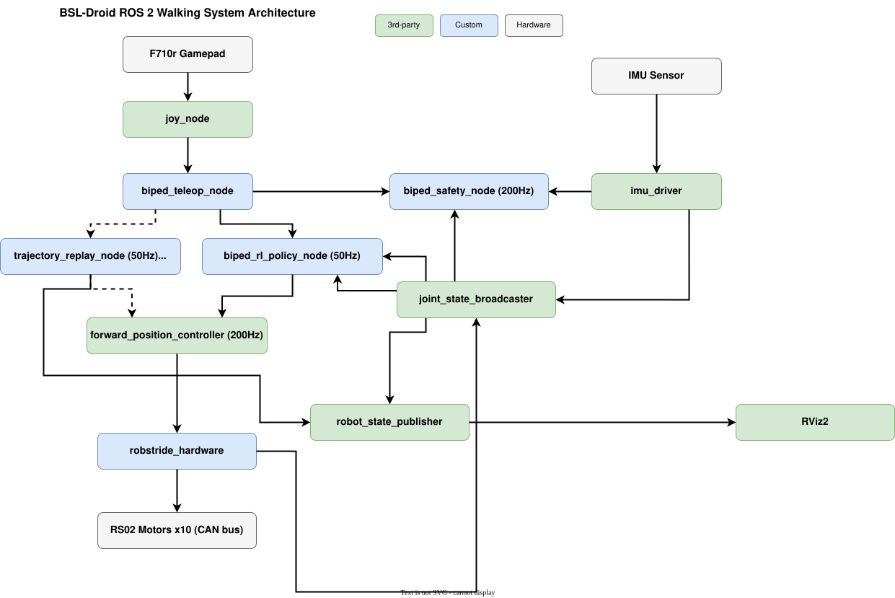

# BSL-Droid ROS 2 歩行制御システム — アーキテクチャ設計

## 1. 概要

本書はBSL-DroidのROS 2歩行制御システムのアーキテクチャを定義する。Logitech F710rゲームパッドで速度指令を入力し、RL学習済みポリシーが歩容を生成する。simモードではGenesis物理エンジンと直接トピック交換で制御ループを構成し、将来のcontrolモード（実機）ではros2_controlを介してRS02モータを制御する。

### 1.1 設計目標

- ゲームパッドによるテレオペレーション歩行の実現
- Genesisシミュレーション（simモード）→ 実機制御（controlモード）への段階的移行
- biped_description, aoba_hardwareパッケージとの統合
- 200Hzリアルタイム制御と50HzRLポリシー推論の両立

### 1.2 基盤システムのアーキテクチャ図

以下の図は本歩行制御システムの基盤となる設計を示す。

- [制御層階層構造図](./fig/system_architecture.drawio.svg) — 5層制御階層（High-Level → Gait → State Estimation → RT Control → Hardware）
- [分散システム構成図](../system/fig/distributed_system_architecture.drawio.svg) — Jetson/MacBook間のノード配置とROS 2 DDS通信
- [データフロー図](./fig/data_flow.drawio.svg) — センサ→状態推定→歩容生成→モータ制御のデータフロー
- [開発ワークフロー図](./fig/development_workflow.drawio.svg) — MacBook開発→Git→Jetsonデプロイの手順

## 2. システムアーキテクチャ全体図



### 2.1 パッケージ構成

本システムは以下のパッケージで構成される。

| パッケージ | ビルド | 役割 | 実装状態 |
|---|---|---|---|
| `biped_description` | ament_cmake | URDF定義、RViz可視化 | [実装済み] |
| `aoba_hardware` | ament_cmake | ros2_control HW Interface (Jetson専用) | [実装済み] |
| `biped_msgs` | ament_cmake | カスタムメッセージ定義（SafetyStatus, RLPolicyState） | [実装済み] |
| `biped_rl_policy` | ament_python | RLポリシー推論（simモード） | [実装済み] |
| `biped_genesis_sim` | ament_python | Genesis物理シミュレーションブリッジ（環境ノード） | [実装済み] |
| `biped_gait_control` | ament_python | IK軌道ベースの歩容生成、および軌道リプレイによるハードウェア検証ツール | [実装済み] |
| `biped_safety` | ament_python | 安全監視（緊急停止・ゲームパッド切断検出・将来: 関節・姿勢監視） | [一部実装済み] |
| `biped_bringup` | ament_cmake | Launch統合・設定ファイル | [実装済み] |

### 2.2 ノードグラフ

#### simモード（Genesis物理シミュレーション）[実装済み]

genesis_sim_nodeとbiped_rl_policy_nodeが同期イベント駆動ループを構成する:

```
F710r Gamepad → [joy_node] → /joy → [teleop_twist_joy_node] → /cmd_vel → [genesis_sim_node]
                                   → /joy → [biped_joy_safety_node] → /emergency_stop

[genesis_sim_node] → /policy_obs (Float64MultiArray, 50次元) → [biped_rl_policy_node]
[biped_rl_policy_node] → /policy_actions (Float64MultiArray, 10次元) → [genesis_sim_node]

[genesis_sim_node] → /joint_states → [robot_state_publisher] → /tf
[genesis_sim_node] → /clock
```

genesis_sim_nodeが物理ステップ・観測ベクトル構築・PD制御を担当し、biped_rl_policy_nodeは純粋な推論ラッパーとして動作する。ros2_controlは使用しない。

#### controlモード（実機制御）[未実装・計画]

```
F710r Gamepad → [joy_node] → /joy → [teleop_twist_joy_node] → /cmd_vel → [biped_rl_policy_node] → /fwd_pos_ctrl/commands → [forward_position_controller] → [aoba_hardware] → CAN → RS02 Motors
                                   → /joy → [biped_joy_safety_node] → /emergency_stop

[aoba_hardware] → [joint_state_broadcaster] → /joint_states → [biped_rl_policy_node] (観測構築)
                                                    /joint_states → [robot_state_publisher] → /tf → [RViz2]
[imu_driver] → /imu/data → [biped_rl_policy_node] (姿勢観測)

[biped_safety_node] ← /joint_states, /imu/data, /cmd_vel
                    → /safety_status, /emergency_stop
```

#### 軌道リプレイモード（ハードウェア検証）[実装済み]

trajectory_replay_nodeがタイマー駆動で事前設計された脚軌道を再生する。Strategy Patternにより足軌道IK・単関節正弦波・ウェイポイント補間の3種類の軌道ソースを設定ファイルで切り替え可能。RViz2上の3Dモデルと実機の動きの一致を確認する用途に使用する。

##### vizモード（RViz可視化のみ）

```
[trajectory_replay_node] → /joint_states → [robot_state_publisher] → /tf → [RViz2]
                         ← /emergency_stop ← [biped_joy_safety_node]
```

##### controlモード（実機制御）

```
[trajectory_replay_node] → /joint_states → [robot_state_publisher] → /tf → [RViz2]
                         → /forward_position_controller/commands → [forward_position_controller] → [aoba_hardware] → CAN → RS02 Motors
                         ← /emergency_stop ← [biped_joy_safety_node]
```

詳細はbiped_gait_controlモジュール設計書を参照。

## 3. 主要トピック一覧

| トピック名 | メッセージ型 | 周波数 | Publisher | Subscriber | 実装状態 |
|---|---|---|---|---|---|
| `/joy` | sensor_msgs/Joy | ~100Hz | joy_node | teleop_twist_joy_node, biped_joy_safety_node | [実装済み] |
| `/cmd_vel` | geometry_msgs/Twist | ~50Hz | teleop_twist_joy_node | genesis_sim_node (sim) | [実装済み] |
| `/policy_obs` | std_msgs/Float64MultiArray | 50Hz | genesis_sim_node | biped_rl_policy_node (sim) | [実装済み] |
| `/policy_actions` | std_msgs/Float64MultiArray | 50Hz | biped_rl_policy_node (sim) | genesis_sim_node | [実装済み] |
| `/joint_states` | sensor_msgs/JointState | 50Hz | genesis_sim_node (sim) / trajectory_replay_node | robot_state_publisher | [実装済み] |
| `/clock` | rosgraph_msgs/Clock | 50Hz | genesis_sim_node | 全ノード (use_sim_time) | [実装済み] |
| `/emergency_stop` | std_msgs/Bool | イベント | biped_joy_safety_node | biped_rl_policy_node, trajectory_replay_node | [実装済み] |
| `/tf` | tf2_msgs/TFMessage | 50Hz | robot_state_publisher | RViz2 | [実装済み] |
| `/forward_position_controller/commands` | std_msgs/Float64MultiArray | 50Hz | biped_rl_policy_node / trajectory_replay_node (control) | forward_position_controller | [一部実装済み: 軌道リプレイcontrolモード] |
| `/imu/data` | sensor_msgs/Imu | 200Hz | imu_driver | biped_rl_policy_node, biped_safety_node | [未実装・計画: controlモード] |
| `/safety_status` | biped_msgs/SafetyStatus | 200Hz | biped_safety_node | (モニタリング) | [未実装・計画] |
| `/rl_policy_state` | biped_msgs/RLPolicyState | 50Hz | biped_rl_policy_node | (デバッグ) | [未実装・計画] |

## 4. 主要な設計判断

### 4.1 joy_node + teleop_twist_joy（ROS 2標準）を使用

pygameや自前のteleop実装ではなく、ROS 2標準の`joy_node` + `teleop_twist_joy`を使用する。理由:
- デバイスhotplug対応
- ROS 2エコシステムとの統合（rqt, rosbag等でJoyメッセージを記録・再生可能）
- QoS設定やDDSを通じた分散動作が容易
- `teleop_twist_joy`はデッドマンスイッチ・軸マッピング・速度スケーリングをパラメータのみで設定可能であり、自前実装の保守コストを排除できる
- 緊急停止・切断検出は`biped_joy_safety_node`（biped_safetyパッケージ）が分担する

### 4.2 RLポリシーはPython (rclpy)

PyTorchモデル（MLP 512-256-128）の50Hz推論はPythonで十分にレイテンシ要件（<10ms）を満たす。libtorchへの移植はプロファイリング結果を見てから判断する。

### 4.3 ForwardCommandController利用 [controlモードのみ・未実装]

RL出力 `action * 0.25 + default_dof_pos` を直接ForwardCommandControllerに送信する。ハードウェアPD（kp=35, kd=2）が200Hzで位置追従を行う。JointTrajectoryControllerではなくForwardCommandControllerを選択した理由:
- RLポリシーが50Hz毎に目標位置を更新するため、軌道補間は不要
- ハードウェアPDが200Hzで補間を行うため十分な滑らかさを確保

simモード（Genesis）では、genesis_sim_nodeが内部でPD制御（kp=35, kd=2、関節別オーバーライドあり）を直接実行するため、ros2_controlは使用しない。

### 4.4 unitree_rl_gymと同様の50次元観測ベクトル採用

`droid_env_unitree.py:714-730`の観測ベクトル構築を完全に再現する。シミュレータとの不一致はポリシー性能劣化に直結するため、ユニットテストでシミュレータ記録データとの照合を行う。

### 4.5 sim/controlの2モード

- **simモード（Genesis）** [実装済み]: genesis_sim_nodeが物理シミュレーション・観測ベクトル構築・PD制御を担当し、`/policy_obs`をpublish。biped_rl_policy_nodeは`/policy_obs`を受信して推論し`/policy_actions`を返す純粋な推論ラッパー。ros2_controlは使用しない。
- **controlモード** [未実装・計画]: biped_rl_policy_nodeが`/forward_position_controller/commands`をpublish → ros2_control → aoba_hardware → CAN → モータ。Jetsonで動作。

モード選択はLaunchファイルの選択で行う（`genesis_teleop.launch.py` / 将来の `real_control.launch.py`）。

### 4.6 Genesisの採用（Gazebo Harmonicからの計画変更） [計画変更]

当初計画ではGazebo Harmonicをシミュレータとして使用する予定であったが、実装段階でGenesis物理エンジンに変更した。理由:
- RL学習環境（`rl_ws/biped_walking/envs/droid_env_unitree.py`）と同一のエンジンを使用することで、sim-to-sim gapを完全に排除
- 観測ベクトル構築ロジックを学習環境から直接移植可能
- Gazebo↔Genesis間の物理パラメータ差異（質量・慣性・摩擦係数）による歩容劣化を回避
- Python APIによる直接統合が容易で、gz_ros2_controlのようなブリッジレイヤーが不要

### 4.7 軌道リプレイのStrategy Pattern採用

軌道リプレイ機能では、軌道ソースをStrategy Patternで抽象化し、設定ファイルの `source_type` パラメータで切り替え可能とした。理由:
- RLポリシーは閉ループ制御器であり、物理フィードバックなしでは正しい歩容を生成できない。軌道リプレイはオープンループで事前設計された軌道を再生するため、物理シミュレーションなしでもRViz上で歩容を確認可能
- 足軌道IK、単関節正弦波、ウェイポイント補間という異なる検証ニーズに対し、再生ノードのコードを変更せずに設定ファイルの選択のみで対応可能
- 新しい軌道ソース（例: 記録データの再生）を追加する際も、`TrajectorySource` を継承した新クラスの追加のみで対応できる

## 5. 制御階層との対応

本歩行制御システムは[制御層階層構造](./fig/system_architecture.drawio.svg)の以下のレイヤーに対応する:

| 制御層 | 周波数 | 本システムのノード | 備考 |
|---|---|---|---|
| High-Level Control | 10-50Hz | （Phase 3以降） | ゲームパッドが代替 |
| Gait Generation | 50Hz | biped_rl_policy_node | RL推論による歩容生成 |
| State Estimation | 200Hz | genesis_sim_node (sim) / 未実装 (control) | simモードではGenesis内部で完結。controlモードではPhase 3で実装 |
| RT Control & Safety | 200Hz | genesis_sim_node (sim) / forward_position_controller + aoba_hardware (control) | simモードではGenesisの内部PD制御。controlモードは未実装 |
| Hardware | - | RS02 x10, IMU | CAN bus, USB (RS232) |

## 6. 分散構成との対応

分散システムアーキテクチャに基づき、ノードを以下のように配置する:

| ノード | simモード（MacBook） | controlモード（Jetson）[未実装・計画] |
|---|---|---|
| joy_node | MacBook | Jetson（USBゲームパッド接続先） |
| teleop_twist_joy_node | MacBook | Jetson |
| biped_joy_safety_node | MacBook | Jetson |
| biped_rl_policy_node | MacBook | Jetson |
| genesis_sim_node | MacBook | - |
| biped_safety_node | - | Jetson |
| forward_position_controller | - | Jetson |
| aoba_hardware | - | Jetson |
| joint_state_broadcaster | - | Jetson |
| imu_driver | - | Jetson |
| robot_state_publisher | MacBook | 両方 |
| RViz2 | - | MacBook（DDS経由） |

## 7. 段階的実装

| Phase | Session | 内容 | 動作環境 | 進捗 |
|---|---|---|---|---|
| Phase 0 | Session B | パッケージ骨格作成・ビルド確認 | MacBook | [完了] |
| Phase 1 | Session C | ゲームパッド→Genesisシミュレーション歩行（simモード）+ 軌道リプレイ | MacBook | [完了] |
| Phase 2 | Session D | 安全監視・設定整備・テスト | MacBook | [未着手] |
| Phase 3 | Session E | 実機展開（IMU統合・controlモード） | Jetson + MacBook | [未着手] |

詳細はシステム構築計画を参照。

## 8. 参考文献

- [MIT Cheetah Software](https://github.com/mit-biomimetics/Cheetah-Software) — 四脚ロボット制御ソフトウェア
- [Unitree ROS](https://github.com/unitreerobotics/unitree_ros) — Unitree四脚ロボットROS統合
- [Isaac Gym Legged Robots](https://github.com/leggedrobotics/legged_gym) — RL歩行学習環境
- [ROS 2 Control](https://control.ros.org/) — ros2_control公式ドキュメント
- [robot_localization](http://docs.ros.org/en/noetic/api/robot_localization/html/index.html) — EKF/UKFベース状態推定
- [Genesis](https://genesis-world.readthedocs.io/) — Genesis物理エンジン
