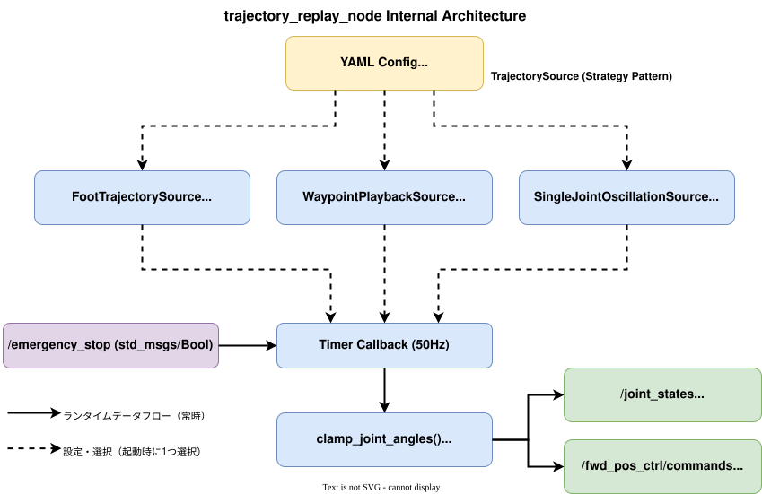

# biped_gait_control パッケージ モジュール設計書

## 1. 概要

`biped_gait_control` は、IK軌道ベースの歩容生成および軌道リプレイによるハードウェア検証を提供するament_pythonパッケージである。

本パッケージは以下の2つのノードを提供する。

| ノード | 用途 | 実装状態 |
|---|---|---|
| `trajectory_replay` | 事前設計された脚軌道の再生によるRViz/実機検証 | [実装済み] |

`trajectory_replay` は **Strategy Pattern** により3種類の軌道ソース（足軌道IK、単関節正弦波、ウェイポイント補間）を設定ファイルの `source_type` パラメータで切り替え可能である。RViz2で可視化される3Dモデル上の歩容と実機の動きが一致することを確認する用途を主眼とする。

### ノード内部構造図



---

## 2. trajectory_replay_node インタフェース

### 2.1 ノード名

`trajectory_replay`

### 2.2 Subscribe トピック

| トピック名 | メッセージ型 | 用途 | モード |
|---|---|---|---|
| `/emergency_stop` | `std_msgs/Bool` | 緊急停止信号。`True` 受信時は全関節をゼロ位置に出力 | 共通 [実装済み] |

### 2.3 Publish トピック

| トピック名 | メッセージ型 | 用途 | モード |
|---|---|---|---|
| `/joint_states` | `sensor_msgs/JointState` | robot_state_publisher向けの関節状態（RViz可視化用） | 共通（常時publish） [実装済み] |
| `/forward_position_controller/commands` | `std_msgs/Float64MultiArray` | ros2_controlへの関節目標位置指令 | controlのみ [実装済み] |

### 2.4 ROSパラメータ

#### 共通パラメータ

| パラメータ名 | 型 | デフォルト | 説明 |
|---|---|---|---|
| `source_type` | string | `"foot"` | 軌道ソース種別。`"foot"`, `"oscillation"`, `"waypoint"` |
| `mode` | string | `"viz"` | 動作モード。`"viz"`（RViz可視化のみ）, `"control"`（RViz + 実機制御） |
| `publish_rate` | float | 50.0 | パブリッシュ周波数 [Hz] |
| `enabled` | bool | `true` | マスタースイッチ。`false` 時はゼロ位置を出力 |

ソース固有パラメータは第4章で記述する。

---

## 3. 動作モード

### 3.1 vizモード（RViz可視化のみ）[実装済み]

RViz2上での3Dモデル確認専用モードである。

- タイマー駆動（デフォルト50Hz）で軌道ソースの `compute()` を呼び出し、10関節の目標角度を取得する。
- 関節リミットクランプ適用後、`/joint_states` をpublishする。
- `robot_state_publisher` がTFツリーを構築し、RViz2で可視化される。
- ハードウェアへの指令は行わない。

### 3.2 controlモード（RViz + 実機制御）[実装済み]

RViz可視化と同時に実機への指令を行うモードである。

- vizモードと同一の軌道計算処理を実行する。
- `/joint_states` に加えて、`/forward_position_controller/commands`（Float64MultiArray）をpublishする。
- ros2_controlの`ForwardCommandController`経由でaoba_hardwareのPD制御により関節を駆動する。

### 3.3 緊急停止

`/emergency_stop` トピックで `True` を受信すると、全関節をゼロ位置（直立姿勢）に出力する。`False` 受信で通常動作に復帰する。状態遷移時にログを出力する。

### 3.4 モード選択

ROSパラメータ `mode` により起動時に決定する。Launchファイルの `mode` 引数で切り替える。

---

## 4. Strategy Pattern と軌道ソース

### 4.1 TrajectorySource 抽象基底クラス

`trajectory_source.py` に定義される抽象基底クラスである。全ソースは以下の正規10関節順序で角度（ラジアン）を返す。

| インデックス | 関節名 | ROS 2 joint名 |
|---|---|---|
| 0 | L_hip_yaw | `left_hip_yaw_joint` |
| 1 | L_hip_roll | `left_hip_roll_joint` |
| 2 | L_hip_pitch | `left_hip_pitch_joint` |
| 3 | L_knee | `left_knee_pitch_joint` |
| 4 | L_ankle | `left_ankle_pitch_joint` |
| 5 | R_hip_yaw | `right_hip_yaw_joint` |
| 6 | R_hip_roll | `right_hip_roll_joint` |
| 7 | R_hip_pitch | `right_hip_pitch_joint` |
| 8 | R_knee | `right_knee_pitch_joint` |
| 9 | R_ankle | `right_ankle_pitch_joint` |

**抽象メソッド:**

| メソッド | 引数 | 戻り値 | 説明 |
|---|---|---|---|
| `configure(node)` | ROS 2ノード | なし | パラメータ宣言と初期化 |
| `compute(elapsed_sec)` | 経過時間 [s] | float[10] | 10関節の目標角度 [rad] を計算 |
| `reset()` | なし | なし | 内部状態のリセット |

### 4.2 FootTrajectorySource（足軌道IK）

`sources/foot_trajectory_source.py` に定義される。`CamberTrajectory`（楕円弧軌道）と2リンク逆運動学を用いて、足先軌道から関節角度を生成する。

**軌道生成の仕組み:**

- **Stance phase（0.0-0.5）**: 足先が地面に接触し、後方から前方へ直線移動
- **Swing phase（0.5-1.0）**: 足先が楕円弧を描いて持ち上がり、前方へ振り出す
- 左右の脚は0.5（180度）の位相差で交互に歩行パターンを生成
- 2リンクIKにより足先位置をhip_pitch + knee_pitchに変換
- ankle_pitchは足先が地面と平行を保つよう計算

**ソース固有パラメータ:**

| パラメータ名 | 型 | デフォルト | 説明 |
|---|---|---|---|
| `foot.step_height` | float | 0.04 | 足持ち上げ高さ [m] |
| `foot.step_length` | float | 0.08 | 歩幅 [m] |
| `foot.step_frequency` | float | 0.5 | 歩行周波数 [Hz] |
| `foot.leg_extension_ratio` | float | 0.90 | 脚の伸展比率（0-1） |
| `foot.thigh_length` | float | 0.11 | 大腿リンク長 [m] |
| `foot.shank_length` | float | 0.12 | 下腿リンク長 [m] |

### 4.3 SingleJointOscillationSource（単関節正弦波）

`sources/single_joint_oscillation_source.py` に定義される。指定した1関節を正弦波で振動させ、他の関節はデフォルト位置に保持する。ハードウェアの動作確認に使用する。

**計算式:**

```
positions[i] = default_positions[i] + offset + amplitude * sin(2π * frequency * t)
```

（`i` は指定関節のインデックス）

**ソース固有パラメータ:**

| パラメータ名 | 型 | デフォルト | 説明 |
|---|---|---|---|
| `oscillation.joint_name` | string | `"left_knee_pitch_joint"` | 振動対象の関節名 |
| `oscillation.amplitude` | float | 0.3 | 振幅 [rad]（約17度） |
| `oscillation.frequency` | float | 0.5 | 振動周波数 [Hz] |
| `oscillation.offset` | float | 0.0 | 中心位置のオフセット [rad] |
| `oscillation.default_positions` | float[10] | 全て0.0 | 全10関節のデフォルト位置 [rad] |

### 4.4 WaypointPlaybackSource（ウェイポイント補間）

`sources/waypoint_playback_source.py` に定義される。タイムスタンプ付きの多関節ウェイポイント列を線形補間で再生する。ループ再生に対応する。

**動作:**

- N個のウェイポイント（各10関節の目標角度）とタイムスタンプを保持
- 経過時間に対応する区間を検索し、前後のウェイポイント間で線形補間
- ループ有効時はモジュロ演算で循環再生

**ソース固有パラメータ:**

| パラメータ名 | 型 | デフォルト | 説明 |
|---|---|---|---|
| `waypoint.times` | float[] | [0.0, 2.0] | ウェイポイントのタイムスタンプ列 [s] |
| `waypoint.positions` | float[] | [0.0]*20 | 全ウェイポイントの関節角度（N×10のフラット配列） [rad] |
| `waypoint.loop` | bool | `true` | ループ再生の有無 |

---

## 5. 関節リミットクランプ

`joint_limits.py` は、URDF定義に基づく関節可動範囲のクランプ機能を提供する。`trajectory_replay_node` は `compute()` の出力に対して常にクランプを適用し、関節リミット超過を防止する。

**関節リミット（左右共通）:**

| 関節 | 下限 [deg] | 上限 [deg] | 下限 [rad] | 上限 [rad] |
|---|---|---|---|---|
| hip_yaw | -30 | 30 | -0.524 | 0.524 |
| hip_roll | -25 | 25 | -0.436 | 0.436 |
| hip_pitch | -120 | 90 | -2.094 | 1.571 |
| knee_pitch | -150 | 0 | -2.618 | 0.000 |
| ankle_pitch | -90 | 90 | -1.571 | 1.571 |

クランプ発生時はPythonのloggingモジュールで警告を出力する。

---

## 6. 設定ファイル

### 6.1 config/replay_foot.yaml

足軌道IKソースの設定。bsl_droid_simplified_v2のリンク長に合わせたパラメータを定義する。

```yaml
trajectory_replay:
  ros__parameters:
    source_type: "foot"
    mode: "viz"
    publish_rate: 50.0
    enabled: true
    foot:
      step_height: 0.04
      step_length: 0.08
      step_frequency: 0.5
      leg_extension_ratio: 0.90
      thigh_length: 0.11
      shank_length: 0.12
```

### 6.2 config/replay_oscillation.yaml

単関節正弦波ソースの設定。ハードウェア個別検証用。

```yaml
trajectory_replay:
  ros__parameters:
    source_type: "oscillation"
    mode: "viz"
    publish_rate: 50.0
    enabled: true
    oscillation:
      joint_name: "left_knee_pitch_joint"
      amplitude: 0.3
      frequency: 0.5
      offset: -0.5
      default_positions: [0.0, 0.0, 0.0, 0.0, 0.0, 0.0, 0.0, 0.0, 0.0, 0.0]
```

### 6.3 config/replay_waypoint.yaml

ウェイポイント補間ソースの設定。左右交互の膝屈曲パターンをループ再生する例。

```yaml
trajectory_replay:
  ros__parameters:
    source_type: "waypoint"
    mode: "viz"
    publish_rate: 50.0
    enabled: true
    waypoint:
      loop: true
      times: [0.0, 1.0, 2.0, 3.0, 4.0]
      positions: [
        0.0, 0.0, 0.0, 0.0, 0.0,  0.0, 0.0, 0.0, 0.0, 0.0,
        0.0, 0.0, 0.3, -0.6, 0.3,  0.0, 0.0, 0.0, 0.0, 0.0,
        0.0, 0.0, 0.0, 0.0, 0.0,  0.0, 0.0, 0.0, 0.0, 0.0,
        0.0, 0.0, 0.0, 0.0, 0.0,  0.0, 0.0, 0.3, -0.6, 0.3,
        0.0, 0.0, 0.0, 0.0, 0.0,  0.0, 0.0, 0.0, 0.0, 0.0,
      ]
```

---

## 7. Launch構成

### 7.1 trajectory_replay.launch.py

`biped_gait_control` パッケージが提供する軌道リプレイ専用の起動ファイルである。

**起動ノード:**

| ノード | パッケージ | 役割 |
|---|---|---|
| trajectory_replay | biped_gait_control | 軌道リプレイ（ソース選択・関節角度計算・publish） |
| robot_state_publisher | robot_state_publisher | URDF→TF変換（bsl_droid_simplified_v2） |
| rviz2 | rviz2 | 3D可視化 |

**Launch引数:**

| 引数 | デフォルト | 説明 |
|---|---|---|
| `config_file` | `replay_foot.yaml` | 設定YAMLファイル名 |
| `mode` | `viz` | 動作モード（`viz` / `control`） |
| `use_sim_time` | `false` | シミュレーション時刻の使用 |

起動コマンドはルートの`README.md`を参照のこと。

---

## 8. 参照ファイル一覧

| ファイルパス | 参照箇所 | 内容 |
|---|---|---|
| `ros2_ws/src/biped_gait_control/biped_gait_control/trajectory_replay_node.py` | 第2, 3章 | TrajectoryReplayNodeの実装 |
| `ros2_ws/src/biped_gait_control/biped_gait_control/trajectory_source.py` | 第4.1節 | TrajectorySource抽象基底クラス |
| `ros2_ws/src/biped_gait_control/biped_gait_control/sources/foot_trajectory_source.py` | 第4.2節 | FootTrajectorySource |
| `ros2_ws/src/biped_gait_control/biped_gait_control/sources/single_joint_oscillation_source.py` | 第4.3節 | SingleJointOscillationSource |
| `ros2_ws/src/biped_gait_control/biped_gait_control/sources/waypoint_playback_source.py` | 第4.4節 | WaypointPlaybackSource |
| `ros2_ws/src/biped_gait_control/biped_gait_control/joint_limits.py` | 第5章 | 関節リミットクランプ |
| `ros2_ws/src/biped_gait_control/biped_gait_control/trajectory.py` | 第4.2節 | CamberTrajectory, WalkingPatternGenerator |
| `ros2_ws/src/biped_gait_control/biped_gait_control/kinematics.py` | 第4.2節 | BipedKinematics（2リンクIK） |
| `ros2_ws/src/biped_gait_control/config/replay_foot.yaml` | 第6.1節 | 足軌道設定 |
| `ros2_ws/src/biped_gait_control/config/replay_oscillation.yaml` | 第6.2節 | 単関節正弦波設定 |
| `ros2_ws/src/biped_gait_control/config/replay_waypoint.yaml` | 第6.3節 | ウェイポイント補間設定 |
| `ros2_ws/src/biped_gait_control/launch/trajectory_replay.launch.py` | 第7章 | 起動ファイル |
