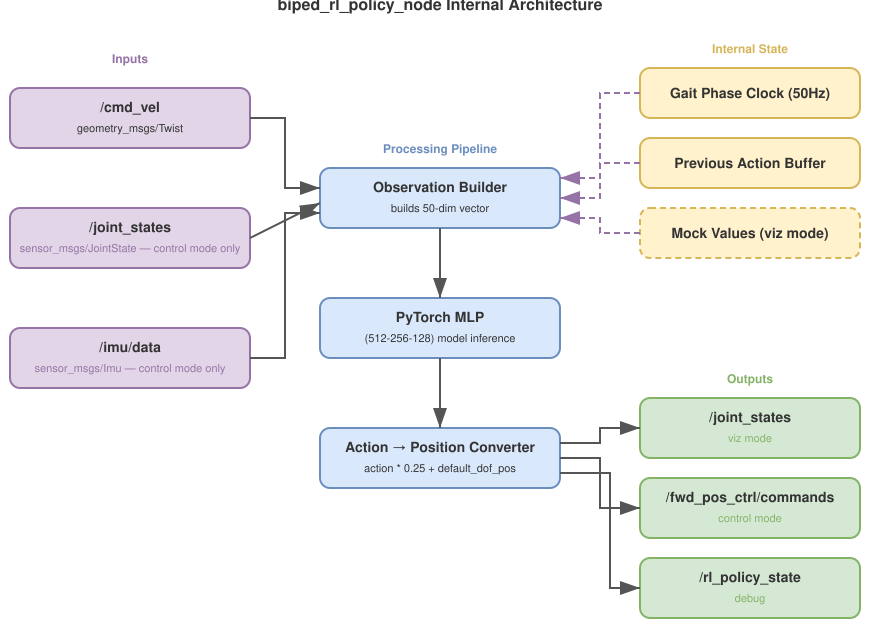

# biped_rl_policy パッケージ モジュール設計書

## 1. 概要

`biped_rl_policy` は、強化学習（RL）で学習済みのポリシーを用いて、速度指令から関節目標位置を50Hzで推論するament_pythonパッケージである。本パッケージはROS 2ノード `biped_rl_policy_node` を1つだけ提供する。

動作モードとして、Genesis物理シミュレーション用の「simモード」と実機制御用の「controlモード」を備える。simモードは実装済みであり、controlモードは将来の実装予定である。コード内にはRViz可視化用の「vizモード」が残存するが、システムレベルのlaunchファイルからは使用されない。

### ノード内部構造図



---

## 2. ノードインタフェース

### 2.1 ノード名

`biped_rl_policy_node`

### 2.2 Subscribe トピック

| トピック名 | メッセージ型 | 用途 | モード |
|---|---|---|---|
| `/cmd_vel` | `geometry_msgs/Twist` | テレオペからの速度指令（lin_vel_x, lin_vel_y, ang_vel_yaw） | vizのみ（コード内残存、システムlaunchでは未使用） |
| `/policy_obs` | `std_msgs/Float64MultiArray` | genesis_sim_nodeからの50次元観測ベクトル | simのみ [実装済み] |
| `/joint_states` | `sensor_msgs/JointState` | エンコーダフィードバック（実関節角度・速度） | controlのみ [未実装・計画] |
| `/imu/data` | `sensor_msgs/Imu` | IMUデータ（角速度・姿勢クォータニオン） | controlのみ [未実装・計画] |
| `/emergency_stop` | `std_msgs/Bool` | 緊急停止信号 | 共通 [実装済み] |

### 2.3 Publish トピック

| トピック名 | メッセージ型 | 用途 | モード |
|---|---|---|---|
| `/joint_states` | `sensor_msgs/JointState` | robot_state_publisher向けの関節状態（可視化用） | vizのみ（コード内残存、システムlaunchでは未使用） [実装済み] |
| `/policy_actions` | `std_msgs/Float64MultiArray` | genesis_sim_nodeへの10次元生アクション | simのみ [実装済み] |
| `/forward_position_controller/commands` | `std_msgs/Float64MultiArray` | ros2_controlへの関節目標位置指令 | controlのみ [未実装・計画] |
| `/rl_policy_state` | `biped_msgs/RLPolicyState` | デバッグ用テレメトリ（観測・行動・推論時間） | 共通 [未実装] |

### 2.4 ROSパラメータ

| パラメータ名 | 型 | デフォルト | 説明 |
|---|---|---|---|
| `mode` | string | `sim` | 動作モード。`sim`（Genesisシミュレーション）、`control`（実機制御）。コード内には`viz`も残存するがシステムlaunchでは未使用 |
| `model_path` | string | `""` | 学習済みモデルファイルのパス（`.pt`）。空の場合はゼロアクション出力 |
| `policy_rate` | float | 50.0 | vizモードの推論周波数 [Hz] |
| `action_scale` | float | 0.25 | アクション→関節位置変換のスケール（vizモードのみ使用） |
| `gait_frequency` | float | 1.5 | 歩容位相の周波数 [Hz]（vizモードのみ使用） |
| `obs_scales.*` | float | 各種 | 観測スケーリング（vizモードのみ使用） |
| `commands_scale` | float[] | [2.0, 2.0, 0.25] | 速度指令スケーリング（vizモードのみ使用） |
| `default_dof_pos` | float[] | [0,0,1.047,...] | デフォルト関節角度（viz/controlモードで使用） |
| `joint_names` | string[] | 10関節名 | 関節名リスト |

---

## 3. 動作モード

### 3.1 vizモード（コード内残存、システムlaunchでは未使用）[実装済み]

> **注意:** vizモードはコード内に残存するが、システムレベルのlaunchファイル（`biped_bringup`）からは使用されない。RLポリシーは閉ループ制御器であり、物理フィードバックなしでは正しい歩容を生成できないため、実用性がなかった。

物理ハードウェアを使用しない可視化専用モードである。

- `/cmd_vel` を subscribe し、50Hzタイマーで推論を実行する。
- `/joint_states` を publish し、`robot_state_publisher` 経由でRViz上にロボットの姿勢を表示する。
- IMUデータとエンコーダデータはモック値で代替する。
  - `base_lin_vel` = [0, 0, 0]
  - `base_ang_vel` = [0, 0, 0]
  - `projected_gravity` = [0, 0, -1]
  - `contact_state` = [1, 1]（常時両足接地）
- 関節位置は前回のポリシー出力をフィードバックして使用する。
- 関節速度は前回出力との有限差分で算出する。
- 観測ベクトル構築、歩行位相クロック、アクション→関節位置変換を自己完結で行う。

### 3.2 simモード（Genesis物理シミュレーション）[実装済み]

Genesis物理シミュレーションとの連携モードである。純粋な推論ラッパーとして動作する。

- `/policy_obs` (Float64MultiArray, 50次元) を subscribe し、イベント駆動で推論を実行する。
- `/policy_actions` (Float64MultiArray, 10次元) を publish する。
- **観測ベクトル構築はgenesis_sim_nodeが担当する**。本ノードは受信した50次元ベクトルをそのままモデルに入力する。
- **タイマー駆動ではなくイベント駆動**: `/policy_obs`メッセージの受信ごとに1回の推論を実行し、即座に`/policy_actions`をpublishする。
- アクション→関節位置変換は行わない。生のアクション（10次元）をそのままgenesis_sim_nodeに返す。genesis_sim_node側で `action * action_scale + default_dof_pos` の変換を行う。
- 緊急停止時はゼロアクション（全要素0.0）を出力する。
- `/cmd_vel`は購読しない（genesis_sim_nodeが直接購読する）。

### 3.3 controlモード（実機制御）[未実装・計画]

実機制御モードである。

- `/forward_position_controller/commands` に `std_msgs/Float64MultiArray` を publish し、ros2_controlの `ForwardCommandController` を介してアクチュエータを駆動する。
- `/joint_states` から実エンコーダデータを取得して観測ベクトルを構築する。
- `/imu/data` から実IMUデータを取得して以下の観測値を算出する。
  - `base_ang_vel`: IMUジャイロスコープの角速度
  - `projected_gravity`: IMUクォータニオンから算出
  - `base_lin_vel`: IMU加速度の積分または運動学推定
- 足接地状態は関節トルクから推定する（力センサなし）。
- 観測ベクトル構築ロジックはgenesis_sim_nodeの実装を参考に移植する。

### 3.4 モード選択

ROSパラメータ `mode` により起動時に決定する。実行中の動的切替は行わない。Launchファイルの選択により適切なモードが設定される。

---

## 4. 観測ベクトル（50次元）

観測ベクトルは学習環境 `droid_env_unitree.py` の `_update_observation()` メソッド（L714-730）と完全に一致させる必要がある。以下に各要素の詳細を示す。

> **注意:** simモードでは観測ベクトルの構築はgenesis_sim_nodeが担当する。以下の仕様はcontrolモード（将来実装）に適用される。vizモード（コード内残存）も同様の自前構築を行う。

### 4.1 観測要素一覧

| インデックス | 要素名 | 次元 | vizモードでのソース | simモードでのソース | controlモードでのソース |
|---|---|---|---|---|---|
| [0:3] | `base_lin_vel` | 3 | [0, 0, 0]（モック） | genesis_sim_node構築 | IMU積分/運動学推定 |
| [3:6] | `base_ang_vel` | 3 | [0, 0, 0]（モック） | genesis_sim_node構築 | IMUジャイロスコープ |
| [6:9] | `projected_gravity` | 3 | [0, 0, -1]（モック） | genesis_sim_node構築 | IMUクォータニオンから算出 |
| [9:12] | `commands` | 3 | `/cmd_vel` から取得 | genesis_sim_node構築 | `/cmd_vel` から取得 |
| [12:22] | `dof_pos - default_dof_pos` | 10 | 前回出力 - default | genesis_sim_node構築 | エンコーダ - default |
| [22:32] | `dof_vel` | 10 | 有限差分で算出 | genesis_sim_node構築 | エンコーダ速度 |
| [32:42] | `actions` | 10 | 前回のアクション出力 | genesis_sim_node構築 | 前回のアクション出力 |
| [42] | `gait_phase_sin` | 1 | sin(2 * pi * phase) | genesis_sim_node構築 | sin(2 * pi * phase) |
| [43] | `gait_phase_cos` | 1 | cos(2 * pi * phase) | genesis_sim_node構築 | cos(2 * pi * phase) |
| [44:46] | `leg_phase` | 2 | gait_phaseから導出 | genesis_sim_node構築 | gait_phaseから導出 |
| [46:48] | `feet_pos_z` | 2 | FK計算または定数 | genesis_sim_node構築 | FK計算または定数 |
| [48:50] | `contact_state` | 2 | [1, 1]（モック） | genesis_sim_node構築 | 関節トルクから推定 |

合計: 3 + 3 + 3 + 3 + 10 + 10 + 10 + 1 + 1 + 2 + 2 + 2 = **50次元**

### 4.2 commands_scale

`commands_scale` はコマンド入力をスケーリングするベクトルであり、`obs_scales` から構成される。

```python
commands_scale = [obs_scales["lin_vel"], obs_scales["lin_vel"], obs_scales["ang_vel"]]
              # = [2.0, 2.0, 0.25]
```

対応する学習設定値（`droid_train_omni_v21.py`）:

```python
obs_scales = {
    "lin_vel": 2.0,
    "ang_vel": 0.25,
    "dof_pos": 1.0,
    "dof_vel": 0.05,
}
```

`/cmd_vel` から取得した `[lin_vel_x, lin_vel_y, ang_vel_yaw]` に `commands_scale` を要素ごとに乗じた値が観測ベクトルの `[9:12]` に格納される。

### 4.3 projected_gravity の算出（controlモード）

IMUから取得したクォータニオン `q` を用いて、ワールド座標系の重力ベクトル `[0, 0, -1]` をボディローカル座標系に変換する。

```python
gravity_world = [0, 0, -1]
projected_gravity = transform_by_quat(gravity_world, inv_quat(q))
```

### 4.4 leg_phase

`leg_phase` は左右の脚それぞれの位相を示す2次元ベクトルである。左脚はgait_phaseそのものに基づき、右脚はpi（半周期）のオフセットを持つ。

### 4.5 feet_pos_z

左右の足先のZ座標（高さ）である。vizモードではFK（順運動学）による算出または定数値を使用する。controlモードでは同様にFKから推定する。

### 4.6 contact_state

左右の足の接地状態を示す2次元ベクトルである。vizモードでは常に `[1, 1]`（両足接地）とする。controlモードでは関節トルク等から推定する。simモードではgenesis_sim_nodeが足リンクのZ高さ（contact_threshold=0.05m）から判定する。

---

## 5. アクションから関節目標位置への変換

### 5.1 変換式

ポリシーの出力（10次元アクション）から関節目標位置への変換は以下の式で行う。

```
target_position = action * action_scale + default_dof_pos
```

この式は `droid_env_unitree.py` L487 に対応する。

> **注意:** simモードではこの変換はgenesis_sim_node側で実行される。biped_rl_policy_nodeは生のアクション（スケーリング前）を`/policy_actions`として出力する。vizモードではbiped_rl_policy_node内で変換を実行する。

### 5.2 action_scale

```
action_scale = 0.25  (rad, 約14度)
```

出典: `droid_train_omni_v21.py` の `env_cfg["action_scale"]`（L172）

### 5.3 default_dof_pos（デフォルト関節角度）

出典: `droid_train_omni_v21.py` L119-150

| 関節名 | 角度（度） | 角度（rad） |
|---|---|---|
| hip_yaw（左右共通） | 0 | 0.0 |
| hip_roll（左右共通） | 0 | 0.0 |
| hip_pitch（左右共通） | 60 | 1.047 |
| knee_pitch（左右共通） | -100 | -1.745 |
| ankle_pitch（左右共通） | 45 | 0.785 |

### 5.4 関節順序

ポリシーの出力は以下の順序で10個の関節に対応する。この順序は学習環境の `env_cfg["joint_names"]` と一致する。

| インデックス | 関節名 | ROS 2 joint名 |
|---|---|---|
| 0 | L_hip_yaw | `left_hip_yaw_joint` |
| 1 | L_hip_roll | `left_hip_roll_joint` |
| 2 | L_hip_pitch | `left_hip_pitch_joint` |
| 3 | L_knee | `left_knee_pitch_joint` |
| 4 | L_ankle | `left_ankle_pitch_joint` |
| 5 | R_hip_yaw | `right_hip_yaw_joint` |
| 6 | R_hip_roll | `right_hip_roll_joint` |
| 7 | R_hip_pitch | `right_hip_pitch_joint` |
| 8 | R_knee | `right_knee_pitch_joint` |
| 9 | R_ankle | `right_ankle_pitch_joint` |

---

## 6. モデルのロード

### 6.1 モデルファイル

- パス形式: `rl_ws/logs/droid-walking-omni-v{N}/model_{iter}.pt`

### 6.2 ネットワーク構造

`biped_rl_policy/actor_mlp.py` の `ActorMLP` クラスを使用する。rsl_rlライブラリのActorCritic構造のactorネットワーク部分のみをスタンドアロンで再実装したものである。pixi ROS 2環境にrsl_rlが利用できないため、この最小実装を使用する。

- 入力: 50次元（観測ベクトル）
- 隠れ層: 512 - 256 - 128（3層MLP）
- 出力: 10次元（アクション）
- 活性化関数: ELU

### 6.3 ロード手順

```python
from biped_rl_policy.actor_mlp import ActorMLP

actor = ActorMLP.from_checkpoint(
    checkpoint_path=model_path,
    num_obs=50,
    num_actions=10,
)
```

`from_checkpoint()` はrsl_rlの `ActorCritic` チェックポイントから `actor.*` キーのみを抽出してロードする。チェックポイントの `model_state_dict` から `actor.0.weight`, `actor.0.bias` 等のキーを `0.weight`, `0.bias` にリネームして `nn.Sequential` にロードする。

### 6.4 ROSパラメータによるパス指定

- `model_path`: `.pt` ファイルへのパス

`model_path` が空文字列の場合、モデルはロードされず、ゼロアクションが出力される。これはlaunchファイルからの設定で制御する。

---

## 7. 歩行位相クロック

### 7.1 概要

vizモード（コード内残存）では内部に歩行位相クロックを保持し、50Hzのタイマーコールバック毎に位相を進行させる。歩行位相は観測ベクトルの `gait_phase_sin`, `gait_phase_cos`, `leg_phase` の算出に使用される。

simモードでは歩行位相クロックはgenesis_sim_nodeが管理し、観測ベクトルに含めてpublishする。

### 7.2 位相更新式

```
phase += gait_frequency * dt
```

- `dt` = 1/50 = 0.02 [s]
- `gait_frequency`: 学習設定から取得。`droid_train_omni_v21.py` では 1.5 [Hz]。
- `phase` は [0, 1) の範囲で循環する（1.0を超えたら1.0を減算）。

### 7.3 位相から観測値への変換

```python
gait_phase_sin = sin(2 * pi * phase)    # [42]
gait_phase_cos = cos(2 * pi * phase)    # [43]
leg_phase = [f(phase), f(phase + 0.5)]  # [44:46] 左脚, 右脚（半周期オフセット）
```

右脚は左脚に対して pi（0.5周期）のオフセットを持ち、交互歩行パターンを生成する。

---

## 8. 内部処理ループ

### 8.1 vizモード（コード内残存）: 50Hzタイマー駆動 [実装済み]

50Hz（20ms周期）のROSタイマーコールバックとして以下の処理を順次実行する。

1. **緊急停止チェック**: 緊急停止中はdefault_dof_posの関節状態をpublishして返す。
2. **速度指令の取得**: 最新の `/cmd_vel` メッセージから `[lin_vel_x, lin_vel_y, ang_vel_yaw]` を読み取る。
3. **関節状態の取得**: 前回のポリシー出力値を使用する。
4. **IMUデータの取得**: モック値を使用する（`base_lin_vel=[0,0,0]`, `base_ang_vel=[0,0,0]`, `projected_gravity=[0,0,-1]`）。
5. **歩行位相の更新**: `phase += gait_frequency * dt`
6. **50次元観測ベクトルの構築**: 第4章に記載した仕様に従い、全50要素を結合する。
7. **ポリシー推論**: `model.eval()` 状態で `torch.no_grad()` コンテキスト内にてforward passを実行する。
8. **アクションクリップ**: [-10, 10]の範囲にクリップする。
9. **アクション→関節位置変換**: `target_position = action * action_scale + default_dof_pos`
10. **出力のPublish**: `/joint_states`（`sensor_msgs/JointState`）をpublishする。

### 8.2 simモード: イベント駆動 [実装済み]

`/policy_obs`メッセージの受信をトリガーとして以下の処理を実行する。タイマーは使用しない。

1. **観測ベクトルの検証**: 受信データが50次元であることを確認する。
2. **緊急停止チェック**: 緊急停止中はゼロアクション（全要素0.0）をpublishして返す。
3. **ポリシー推論**: 受信した50次元ベクトルをtorch.tensorに変換し、`torch.no_grad()`でforward passを実行する。
4. **出力のPublish**: `/policy_actions`（`std_msgs/Float64MultiArray`）として10次元のアクションをpublishする。

### 8.3 タイミング制約

- ポリシー推論のレイテンシは10ms以下を目標とする（NFR-01）。
- PyTorch MLPの50Hz推論はCPUのみで十分達成可能である。GPU（CUDA）は使用しない。
- Jetson Orin Nano Super（ARM64, 8GB RAM）での動作を前提とする。

### 8.4 内部状態バッファ

#### vizモード（コード内残存）

ノードは以下の内部状態を保持する。

| 状態変数 | 型 | 初期値 | 用途 |
|---|---|---|---|
| `prev_actions` | float[10] | 全て0.0 | 前回アクション（観測ベクトル[32:42]） |
| `dof_pos` | float[10] | `default_dof_pos` | 現在関節位置 |
| `dof_vel` | float[10] | 全て0.0 | 現在関節速度 |
| `gait_phase` | float | 0.0 | 歩行位相クロック |
| `commands` | float[3] | [0, 0, 0] | 最新の速度指令 |
| `base_lin_vel` | float[3] | [0, 0, 0] | ベース線速度（モック） |
| `base_ang_vel` | float[3] | [0, 0, 0] | ベース角速度（モック） |
| `projected_gravity` | float[3] | [0, 0, -1] | 射影重力（モック） |
| `feet_pos_z` | float[2] | [0, 0] | 足先Z座標 |
| `contact_state` | float[2] | [1, 1] | 接地状態（モック） |

#### simモード

simモードでは内部状態バッファは保持しない（`_emergency_stop` フラグのみ）。観測・歩行位相・アクション履歴はgenesis_sim_nodeが管理する。

---

## 9. 参照ファイル一覧

| ファイルパス | 参照箇所 | 内容 |
|---|---|---|
| `rl_ws/biped_walking/envs/droid_env_unitree.py` L714-730 | 第4章 | 観測ベクトルの構築処理 |
| `rl_ws/biped_walking/envs/droid_env_unitree.py` L487 | 第5章 | アクション→関節位置変換式 |
| `rl_ws/biped_walking/envs/droid_env_unitree.py` L295-298 | 第4.2節 | `commands_scale` の定義 |
| `rl_ws/biped_walking/biped_eval_gamepad.py` | 全体 | ゲームパッド評価ループの参考実装 |
| `rl_ws/biped_walking/train/droid_train_omni_v21.py` L119-122 | 第5.3節 | デフォルト関節角度の定義 |
| `rl_ws/biped_walking/train/droid_train_omni_v21.py` L124-189 | 第4.2節, 第5.2節 | `env_cfg`, `obs_cfg` の定義 |
| `ros2_ws/src/biped_rl_policy/biped_rl_policy/actor_mlp.py` | 第6章 | ActorMLP実装 |
| `ros2_ws/src/biped_genesis_sim/biped_genesis_sim/genesis_sim_node.py` | 第3.2節 | simモードの環境ノード |
