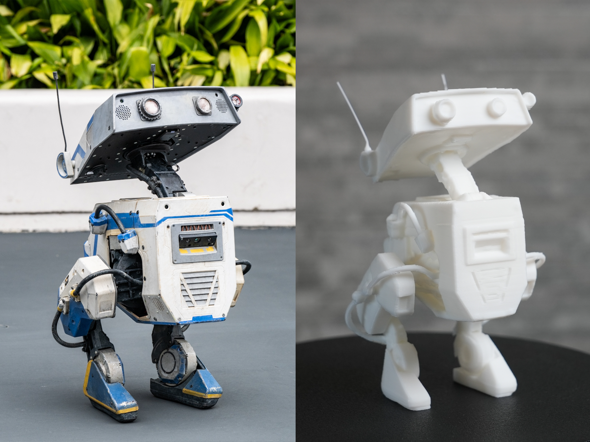
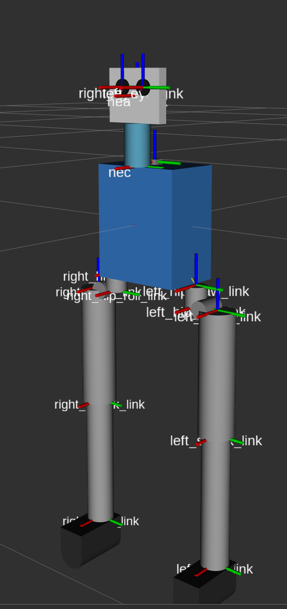
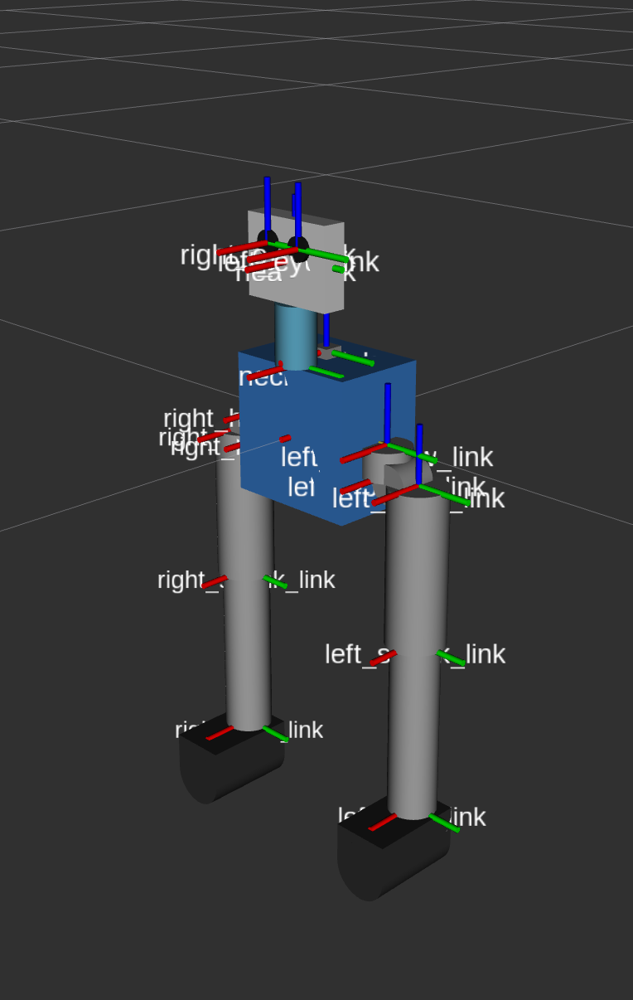
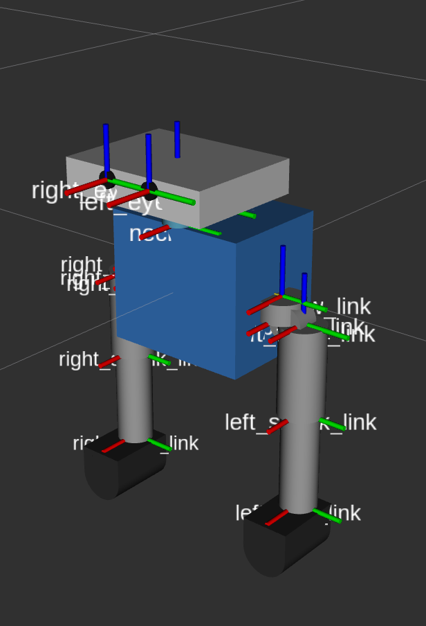
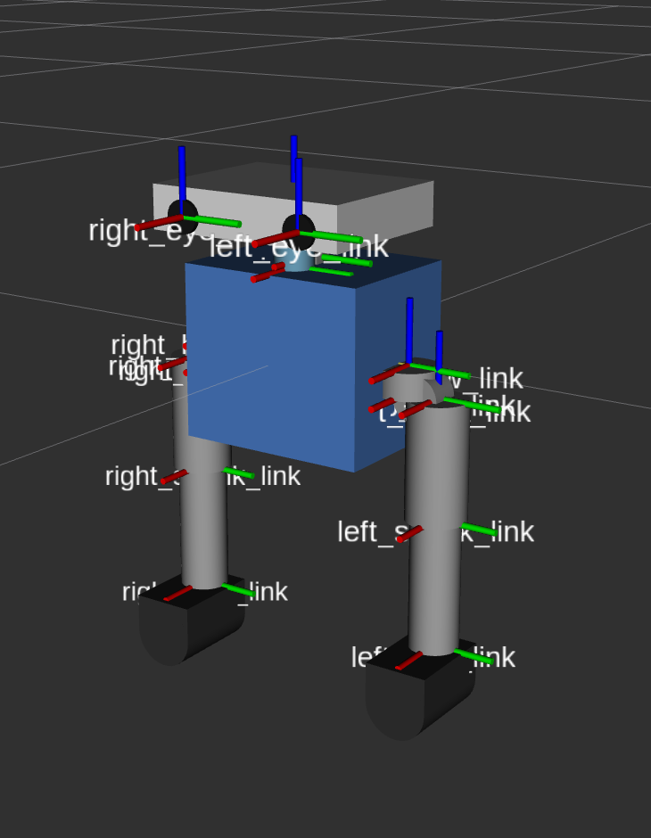
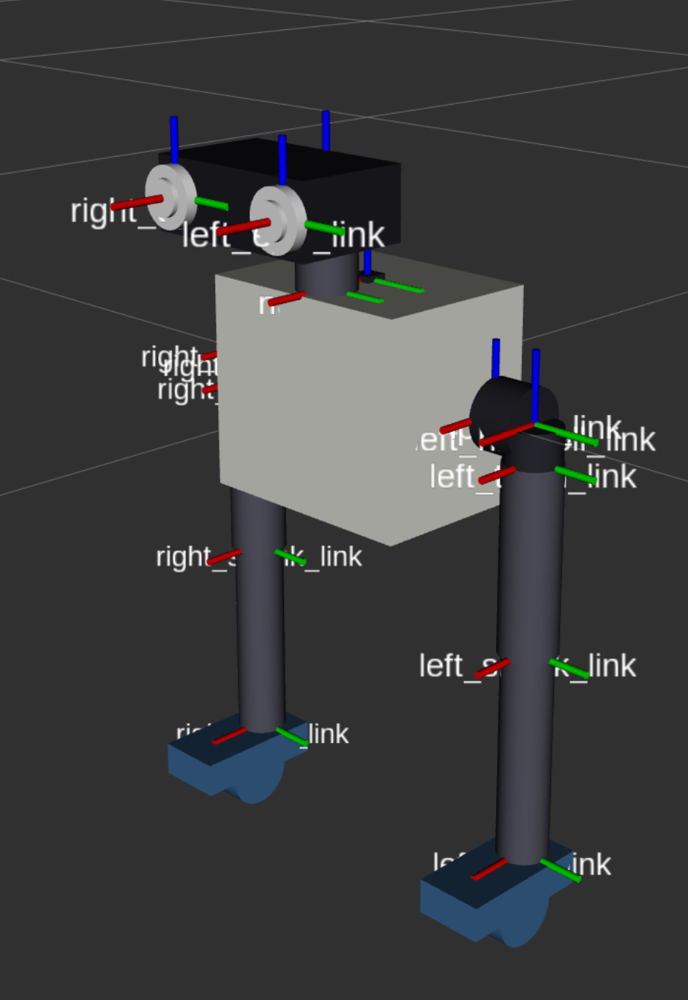
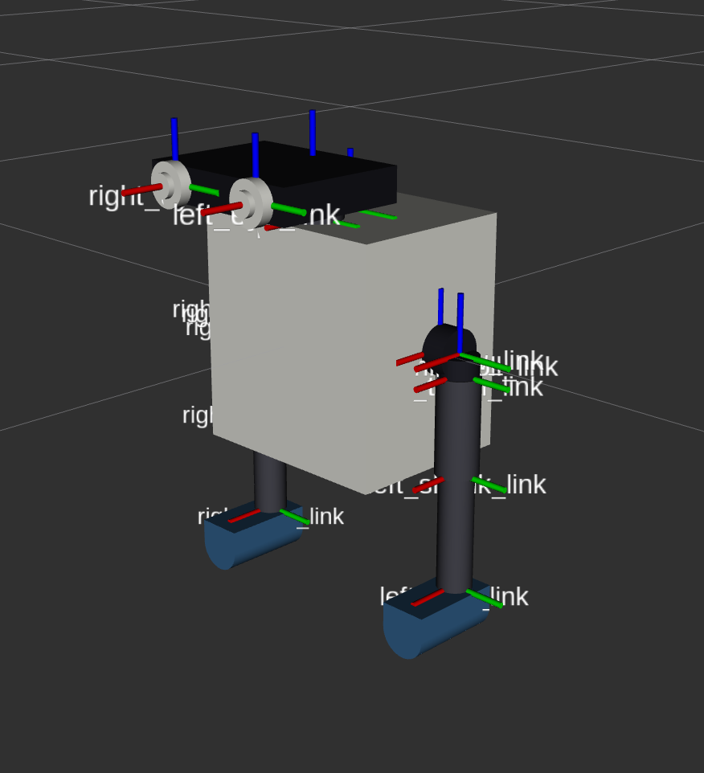

# EXP003: BD-1風二脚ロボットURDFモデル設計

## 概要

BDX-Droidの画像を参考に、GitHub CopilotおよびClaude Codeを用いて逆関節（鳥脚型）二脚ロボットのURDFモデルを設計した。既存の`biped_digitigrade.urdf.xacro`を元に、より可愛らしいプロポーションとバランスの取れた外観を目指した反復的な改善を実施した。

本実験では2つのAIツールで並行して同じタスクを実施し、最終的にCopilot版を採用した。

## 参考画像


*BDX-Droid: 左が実機、右が3Dプリントモデル。大きな箱型胴体と短い脚、顔の大きさが特徴*

3Dモデル共有サイトであるMakerWorldから引用した．これは写実的な画像と3DCGのように簡略化された画像の両方をcoding agentに与えることで性能向上を狙うためである．
URL: https://makerworld.com/ja/models/1297036-bdx-droid-fan-made-3d-printable-model#profileId-1328605 

## 設計要件

| 項目 | 要件 |
|------|------|
| 関節構成 | 片脚5軸（股関節ヨー、股関節ロール、股関節ピッチ、膝ピッチ、足首ピッチ） |
| 総関節数 | 10軸（左右対称・鏡像配置） |
| 脚の取り付け | 胴体下面ではなく**胴体側面の中央部**から生える |
| 膝関節 | 逆関節（鳥脚型：膝が**後方**へ曲がる） |
| 足首位置 | 足の後端から中心方向へオフセット |
| 足裏形状 | かまぼこ型（半円柱）でロール軸代替・受動安定性確保 |
| 頭部 | 胴体前方に首、その上に顔（関節なし・固定） |
| 顔の形状 | **前後方向に長く、高さは低い**（胴体からはみ出す程度） |
| 目 | 顔前面に2つの円形、**間隔が広く大きめ** |
| 全高 | 約0.6m（短足でかわいらしいプロポーション） |

## 開発プロセス

### 初期要件定義

**ユーザープロンプト（2026年1月30日）**:
```
このリポジトリで学習やROSの表示に使っている二脚ロボットのxacroの3Dモデル
`ros2_ws/src/biped_description/urdf/biped_digitigrade.urdf.xacro`を，
添付の画像も参考に以下の要件でブラッシュアップしたものを新しく作成しなさい．
既存プロセスが参照しているため元ファイルに変更を加えてはいけません．

- 片脚に5軸
    - 股関節ヨー，股関節ロール，股関節ピッチ，膝ピッチ，足首ピッチ
- 鏡写しの面対象で二脚，合計10軸
- 胴体の下から脚が生えるのではなく，胴体の左右側面の両側から脚が生える
- 鳥型の逆関節（膝が胴体後方へ曲がる）
- 足(foot)の後端から少し中心へズレたところに足首がある
- 足裏はかまぼこをひっくり返したような半円状の形状で地面に接地し，足のロール関節を代替する．
- 胴体の前方に首がある
- 首の上に薄い直方体の顔がある
    - 顔の前方には円形で二つの目がある
- 首と顔に関節は一切不要（問題を簡単にするため）
- 全高が人間の腰程度の高さ（0.8~1.0m程度）
- 色は開発作業がしやすい想定で適当につけて良い
- ファイル名はsuffixに`_copilot`をつける
```

**成果物**:
- `biped_digitigrade_copilot.urdf.xacro` を新規作成（後に `bsl_droid_simplified.urdf.xacro` へリネーム）
- 既存ファイルは未変更のまま保持

### 可視化環境の整備

**ユーザープロンプト**:
```
それを表示するためのlaunchファイルを書いて．
スライダーで各関節を動かせるGUIもセットのやつ．
```

**成果物**:
- `display_copilot.launch.py` を作成（後に `display_bsl_droid_simplified.launch.py` へリネーム）
- 既存の`joint_gui.py`とRViz設定を再利用

**起動コマンド**:
```bash
cd ros2_ws
pixi run colcon build --packages-select biped_description --symlink-install
pixi run ros2 launch biped_description display_bsl_droid_simplified.launch.py
```

## 反復的改善プロセス

### 初回実装（Iteration 1）


*Iteration 1: 脚が長く、バランスが悪い状態*

**ユーザーフィードバック**:
```
脚の付け根が胴体側面の中央部になっていませんね．
あと全体的にバランスが悪くて不気味の谷です．
脚の各リンクの長さを短くしつつ，
全体のバランスを最初に添付した図のかわいさになるように修正しなさい．
```

**問題点**
- 脚の付け根が胴体底面にあり、側面配置の要件を満たしていない
- 全体のバランスが悪く、脚が長すぎて「不気味の谷」

**対応**
- 脚の取り付け位置を胴体側面中央（Z=0）に変更
- 各リンクの長さを短縮

### Iteration 2



**ユーザーフィードバック**:
```
- 脚のリンクはもっと短くしなさい．
- 胴体はむしろもっと大きくしないとダメじゃない？
- 首が長すぎるので短くしろ
- 顔パーツはロボットの前後方向に長く（ロボットの前後方向の8割くらいの大きさがありますよね元画像）
- 顔パーツのz軸鉛直高さは半分くらいに

これらをベースに画像をよく観察してもっと可愛く
```

**問題点**
- まだ脚が長く、胴体が小さい
- 首が長すぎる
- 顔が小さく、元画像のバランスと異なる

**対応**
- 胴体を大型化（14cm → 18cm幅）
- 脚をさらに短縮（大腿16cm→11cm、下腿18cm→12cm）
- 首を短縮（6cm → 3.5cm）
- 顔を前後方向に拡大（11cm → 15cm）、高さを半減（8cm → 4cm）

**変更内容**:
- 胴体: 幅18cm、奥行14cm、高さ16cm
- 大腿: 11cm
- 下腿: 12cm
- 首: 3.5cm
- 顔: 前後15cm × 幅10cm × 高さ4cm
- 質量配分も短い脚に合わせて調整

### Iteration 3



**ユーザーフィードバック**:
```
素晴らしい！かなり良くなりました．
顔の大きさをxy平面方向にもっと大きくしなさい．
元画像をよく観察して．
胴体のxy平面と同じかなんならちょっとはみ出てない？
顔以外のパーツは触らないで．
```

**問題点**
- 顔が小さい（胴体の約半分のサイズ）
- 元画像では顔が胴体と同じくらいの大きさ

**対応**
- 顔の幅を拡大（10cm → 19cm、胴体18cmより大きく）
- 顔の奥行きを拡大（11cm → 15cm、胴体14cmより大きく）
- 目の間隔を広げる（3.5cm → 6cm）
- 慣性パラメータを調整

**変更内容**:
- 顔: 前後15cm × 幅19cm × 高さ4cm（胴体からはみ出す）
- 目の間隔: 6cm

### 最終調整（Iteration 4）

**ユーザーフィードバック**:
```
良い方向に進化しています．
顔をロボット前後方向でもう少し下げて．
今だと猫背のような見た目で悪いです．
さらに目の間隔を2倍くらいに広げて，
鉛直高さ方向に下げて，
直径も大きくしなさい．
元画像はそのくらいのバランスのはずです．
顔以外のパーツは触らないで．
```

**問題点**
- 顔が前に出すぎて「猫背」に見える
- 目の間隔が狭く、位置が高い
- 目が小さい

**最終調整**
- 首の取り付け位置を後方へ3cmシフト（猫背改善）
  - `origin xyz="${torso_depth/2 - 0.01}"` → `"${torso_depth/2 - 0.04}"`
- 目の間隔を2倍に拡大（6cm → 12cm）
- 目の直径を拡大（2cm → 3cm）
- 目の高さを下げる（Z = +0.8cm → -0.5cm）

**変更内容**:
- 首の取り付け: X = torso_depth/2 - 0.04（後方調整）
- 目の間隔: 12cm
- 目の半径: 1.5cm（直径3cm）
- 目の位置: Z = -0.005m（顔中心より下）


*Iteration 4: 猫背改善、目を大きく広く配置*

**完了時のコメント**:
```
ユーザー: この作業はここで打ち切ります．
```

## 最終モデル仕様

### 作成ファイル

| ファイル | 説明 |
|----------|------|
| `ros2_ws/src/biped_description/urdf/bsl_droid_simplified.urdf.xacro` | URDFモデル本体（旧名: `biped_digitigrade_copilot.urdf.xacro`） |
| `ros2_ws/src/biped_description/launch/display_bsl_droid_simplified.launch.py` | 可視化用launchファイル（旧名: `display_copilot.launch.py`） |

> **Note**: 実験終了後、ファイル名を `biped_digitigrade_copilot` → `bsl_droid_simplified` へ変更した。

### 寸法パラメータ

#### 胴体

| パラメータ | 値 | 備考 |
|-----------|-----|------|
| 幅（Y軸） | 0.18 m | 左右方向 |
| 奥行き（X軸） | 0.14 m | 前後方向 |
| 高さ（Z軸） | 0.16 m | 鉛直方向 |
| 質量 | 3.2 kg | |

#### 脚部

| 部位 | パラメータ | 値 | 備考 |
|------|-----------|-----|------|
| 股関節オフセット | hip_offset_y | 0.10 m | 胴体中心から股関節ヨー軸 |
| ヨー軸リンク | hip_yaw_length | 0.025 m | |
| ロール軸リンク | hip_roll_length | 0.03 m | 外側方向 |
| 大腿部 | thigh_length | 0.11 m | |
| 大腿部半径 | thigh_radius | 0.028 m | |
| 下腿部 | shank_length | 0.12 m | |
| 下腿部半径 | shank_radius | 0.023 m | |

#### 足部

| パラメータ | 値 | 備考 |
|-----------|-----|------|
| 長さ（前後） | 0.09 m | |
| 幅（左右） | 0.06 m | |
| 高さ | 0.035 m | |
| 足首オフセット | 0.02 m | 足後端から中心寄り |
| 足裏形状 | 半円柱 | 直径0.06m、長さ0.09m |

#### 頭部

| 部位 | パラメータ | 値 | 備考 |
|------|-----------|-----|------|
| 首 | 長さ | 0.035 m | 短く |
| 首 | 半径 | 0.018 m | |
| 首位置 | X | torso_depth/2 - 0.04 m | 後方調整で猫背改善 |
| 顔 | 幅（Y） | 0.19 m | **胴体より大きい** |
| 顔 | 奥行き（X） | 0.15 m | **胴体より大きい** |
| 顔 | 高さ（Z） | 0.04 m | **薄い** |
| 目 | 半径 | 0.015 m | **大きめ** |
| 目 | 間隔 | 0.12 m | **広い** |
| 目 | 高さ | -0.005 m | **低い位置** |

### 関節仕様

#### 左脚（right側も対称）

| 関節名 | 軸 | 可動範囲 | 最大トルク | 最大速度 |
|--------|-----|----------|-----------|----------|
| left_hip_yaw_joint | Z | -30° ~ +30° | 50 Nm | 5 rad/s |
| left_hip_roll_joint | X | -25° ~ +25° | 50 Nm | 5 rad/s |
| left_hip_pitch_joint | Y | -120° ~ +60° | 100 Nm | 10 rad/s |
| left_knee_pitch_joint | Y | 0° ~ +135° | 100 Nm | 10 rad/s |
| left_ankle_pitch_joint | Y | -60° ~ +60° | 50 Nm | 10 rad/s |

**注意**: 膝関節は正の角度で後方（ロボット後方）に曲がる逆関節構造

### カラースキーム

| 部位 | カラー | RGBA |
|------|--------|------|
| 胴体 | 青系 | (0.3, 0.5, 0.8, 1.0) |
| 脚 | グレー | (0.6, 0.6, 0.6, 1.0) |
| 足 | 黒 | (0.2, 0.2, 0.2, 1.0) |
| 首 | 青緑系 | (0.4, 0.6, 0.7, 1.0) |
| 顔 | 白 | (0.9, 0.9, 0.9, 1.0) |
| 目 | 黒 | (0.1, 0.1, 0.1, 1.0) |

## 設計の要点

### 成功要因

1. **反復的フィードバック**: 4回の改善サイクルで徐々に最適化
2. **元画像の詳細観察**: ユーザーによる参考画像の継続的な参照
3. **段階的改善**: 一度に全てを変更せず、各イテレーションで特定の問題に集中
4. **既存ファイルの保護**: `_copilot`サフィックスで新規ファイルとして管理

### 重要な設計判断

| 設計要素 | 初期値 | 最終値 | 理由 |
|---------|--------|--------|------|
| 脚の長さ | 長い | 短い（大腿11cm、下腿12cm） | 可愛らしさ、安定性 |
| 胴体サイズ | 小さい | 大きい（18×14×16cm） | プロポーションバランス |
| 顔のサイズ | 胴体の半分 | 胴体より大きい（19×15×4cm） | BD-1の特徴的外観 |
| 脚の取り付け | 胴体底面 | 胴体側面中央（Z=0） | 要件適合 |
| 首の位置 | 前方 | 後方調整 | 猫背解消 |
| 目の配置 | 狭い・高い・小さい | 広い（12cm）・低い・大きい（直径3cm） | BD-1の表情 |

## 技術的詳細

### 実装上の工夫

### 1. 胴体側面からの脚生成

```xml
<!-- 股関節ヨー軸が胴体側面中央（Z=0）から生える -->
<origin xyz="0 ${reflect * hip_offset_y} 0" rpy="0 0 0"/>
```

従来は`Z = -torso_height/2`（胴体底面）だったが、`Z = 0`（胴体中央）に変更

### 2. 逆関節の実装

```xml
<!-- 膝関節：正の角度で後方に曲がる -->
<limit lower="${0 * pi / 180}" upper="${135 * pi / 180}" 
       effort="100" velocity="10"/>
```

従来の`lower=-120°, upper=0°`から反転

### 3. 足裏の半円形状

```xml
<!-- 足裏の半円形状（Y軸方向に円筒を配置） -->
<origin xyz="${ankle_offset_x} 0 ${-foot_height}" rpy="0 ${pi/2} 0"/>
<geometry>
  <cylinder radius="${foot_width/2}" length="${foot_length}"/>
</geometry>
```

ロール方向の受動的安定性を確保

### 4. 大きく低い顔の実現

```xml
<!-- 前後に長く（15cm）、高さは低い（4cm） -->
<box size="${head_depth} ${head_width} ${head_height}"/>
<!-- head_depth=0.15, head_width=0.19, head_height=0.04 -->
```

### 5. 広く配置された大きな目

```xml
<!-- 左目：間隔12cm、直径3cm、低い位置 -->
<origin xyz="${head_depth/2 + 0.003} ${eye_spacing/2} -0.005" rpy="0 0 0"/>
<cylinder radius="${eye_radius}" length="0.005"/>
<!-- eye_spacing=0.12, eye_radius=0.015 -->
```

## 可視化と動作確認

### ビルド

```bash
cd ros2_ws
pixi run colcon build --packages-select biped_description --symlink-install
```

### 起動

```bash
pixi run ros2 launch biped_description display_bsl_droid_simplified.launch.py
```

起動すると以下が立ち上がる：
- **RViz2**: 3Dモデルの可視化
- **Joint GUI**: PyQt5ベースのスライダーGUIで各関節を手動操作可能
- **robot_state_publisher**: URDFからTF配信

### 開発時のスクリーンショット（まとめ）

スクリーンショットは各Iterationセクションに掲載済み。

### Claude Code版の試行

同時期にClaude Codeでも同様の実験を行った。Claude Code版は途中で打ち切りとなったが、参考として以下に掲載する。

**Claude Code版の成果物（不採用）**:
- `biped_digitigrade_claude_code.urdf.xacro`
- `display_claude_code.launch.py`

**Claude Code版の課題**:
- プロポーションの調整が不十分で「不気味の谷」感が残った
- 足裏のかまぼこ型の向きが90度間違っていた（初期実装）
- 反復改善の回数がCopilot版より少なく、完成度が低かった


*Claude Code版 Iteration 1: 初期実装*


*Claude Code版 Iteration 2: プロポーション調整後（打ち切り時点）*

## 今後の展開

### Phase 1: シミュレーション準備

1. **MuJoCo変換**
   - URDFからMJCF形式への変換
   - 地面接触設定の最適化
   - アクチュエータパラメータの調整

2. **Genesis環境構築**
   - 10軸二脚ロボット用の環境クラス作成
   - 報酬関数の設計（前進、姿勢維持、エネルギー効率）
   - 観測空間の定義（39次元：IMU 6 + joint pos/vel 20 + command 3 + 予備 10）

### Phase 2: 強化学習

1. **歩容獲得**
   - PPOアルゴリズムによる訓練
   - sim2simパイプライン（Genesis → MuJoCo）での検証

2. **実機展開**
   - ros2_controlインターフェースの実装
   - Jetson Orin Nano Superでの制御ループ（200Hz）

## 課題と改善案

### 設計上の課題

1. **質量分布の最適化**
   - 現在の質量配分は暫定値
   - 実機の部品構成に基づく精密化が必要

2. **関節可動範囲の検証**
   - 実機の物理的制約との照合
   - 衝突回避の検証

3. **足裏接触モデル**
   - 半円形状の摩擦係数調整
   - 接触点の最適化

### 今後の改善方向

1. **見た目の改善**
   - アンテナなどの装飾パーツ追加
   - より詳細なメッシュモデルの導入

2. **機能追加**
   - 首のピッチ・ヨー関節追加（カメラジンバル）
   - 胴体上部の収納スペース定義

3. **シミュレーション最適化**
   - 衝突形状の簡略化
   - 計算効率の向上

## 結論

GitHub Copilotを用いた反復的改善により、元画像（BD-1ドロイド）のプロポーションに近い、可愛らしい二脚ロボットのURDFモデルを設計できた。特に以下の点が重要だった：

1. **胴体と脚のバランス**: 短い脚、大きな胴体
2. **顔の大きさ**: 胴体と同等以上のサイズ、前後に長く低い
3. **脚の取り付け位置**: 胴体側面中央から生える構造
4. **目の配置**: 大きく、広く、低い位置

既存の`biped_digitigrade.urdf.xacro`には変更を加えておらず、新規ファイル`bsl_droid_simplified.urdf.xacro`（旧名: `biped_digitigrade_copilot.urdf.xacro`）として独立して管理されている。今後の強化学習実験（EXP002の二脚版）への展開が期待される。

### 開発における学び

1. **視覚的フィードバックの重要性**: RVizでの即座の確認が改善を加速
2. **段階的改善の効果**: 大きな変更を一度に行わず、問題を分離して解決
3. **参考資料の活用**: 実物写真との継続的な比較が最適解への道筋
4. **保守性の確保**: 既存ファイルを保護しつつ新機能を開発

### 次のステップ

本実験で得られたモデルは、以下の用途への適用を想定：

1. **EXP002拡張**: Genesis/MuJoCoでの二脚歩行学習
2. **実機制御**: Jetson Orin Nano Superでのros2_control実装
3. **デザイン改良**: より詳細なメッシュモデルやテクスチャの追加

## 付録：完全な会話ログ

### セッション開始（2026年1月30日）

**ユーザー**: このリポジトリで学習やROSの表示に使っている二脚ロボットのxacroの3Dモデル`ros2_ws/src/biped_description/urdf/biped_digitigrade.urdf.xacro`を，添付の画像も参考に以下の要件でブラッシュアップしたものを新しく作成しなさい．既存プロセスが参照しているため元ファイルに変更を加えてはいけません．[要件省略]

**Copilot**: 新しい二脚ロボットのXacroモデル `biped_digitigrade_copilot.urdf.xacro` を作成しました。[詳細省略]

**ユーザー**: それを表示するためのlaunchファイルを書いて．スライダーで各関節を動かせるGUIもセットのやつ．

**Copilot**: 新しいモデル用のlaunchファイル `display_copilot.launch.py` を作成しました。

**ユーザー**: `biped_description`指定でビルドして

**Copilot**: ビルド完了しました。[コマンド実行]

**ユーザー**: 脚の付け根が胴体側面の中央部になっていませんね．あと全体的にバランスが悪くて不気味の谷です．脚の各リンクの長さを短くしつつ，全体のバランスを最初に添付した図のかわいさになるように修正しなさい．

**Copilot**: 全体のバランスを改善しました：[変更内容省略]

**ユーザー**: - 脚のリンクはもっと短くしなさい．- 胴体はむしろもっと大きくしないとダメじゃない？- 首が長すぎるので短くしろ...[省略]

**Copilot**: よりかわいいプロポーションに調整しました：[変更内容省略]

**ユーザー**: 素晴らしい！かなり良くなりました．顔の大きさをxy平面方向にもっと大きくしなさい．元画像をよく観察して．胴体のxy平面と同じかなんならちょっとはみ出てない？顔以外のパーツは触らないで．

**Copilot**: 顔のサイズを拡大しました：- 顔の幅: 10cm → 19cm...[省略]

**ユーザー**: 良い方向に進化しています．顔をロボット前後方向でもう少し下げて．今だと猫背のような見た目で悪いです．さらに目の間隔を2倍くらいに広げて，鉛直高さ方向に下げて，直径も大きくしなさい．元画像はそのくらいのバランスのはずです．顔以外のパーツは触らないで．

**Copilot**: 調整しました：[変更内容省略]

**ユーザー**: この作業はここで打ち切ります．`exp003_...`のレポートにまとめなさい．私が添付した画像も一緒にファイルに保存してレポートに組み入れすることはできますか？

**Copilot**: 実験レポート `exp004_biped_urdf_copilot.md` を作成しました。[画像保存についての説明]

**ユーザー**: レポートに私が与えた会話やプロンプトも全て適切なセクションへ記録として転記しなさい．

**Copilot**: [本更新を実施]

## 参考資料

- [Star Wars Jedi: Fallen Order - BD-1 Droid](https://starwars.fandom.com/wiki/BD-1)
- 既存URDF: `ros2_ws/src/biped_description/urdf/biped_digitigrade.urdf.xacro`
- ROS 2 URDF Tutorial: [https://docs.ros.org/en/jazzy/Tutorials/Intermediate/URDF/URDF-Main.html](https://docs.ros.org/en/jazzy/Tutorials/Intermediate/URDF/URDF-Main.html)
