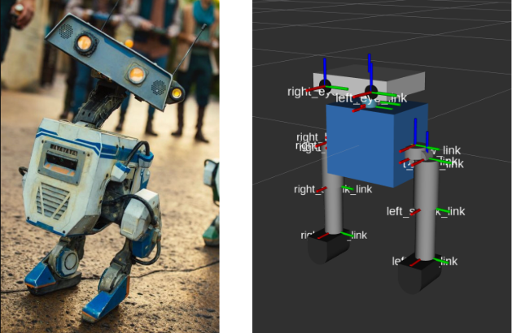
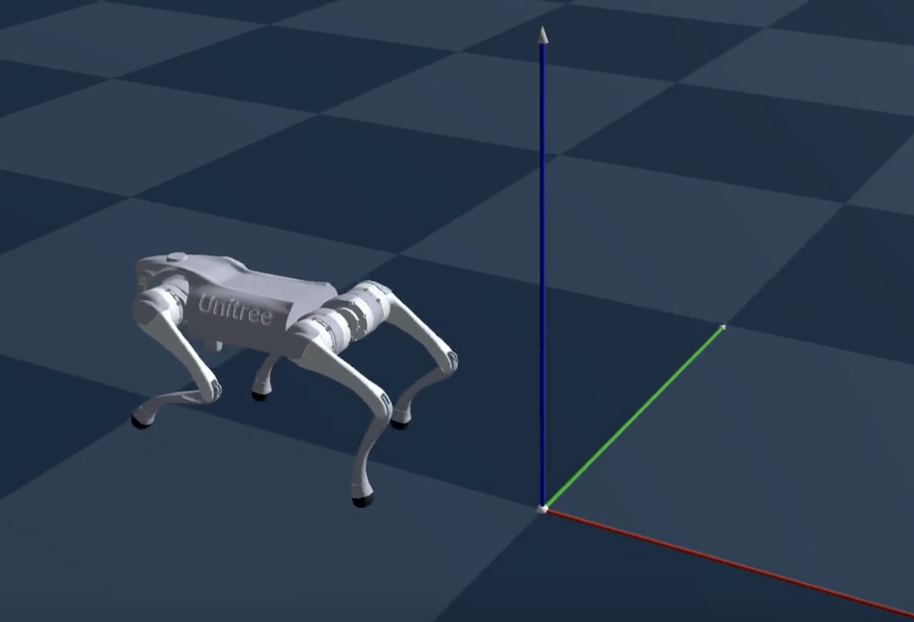
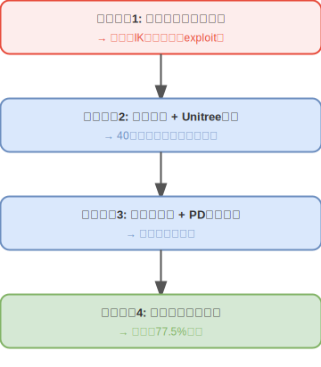
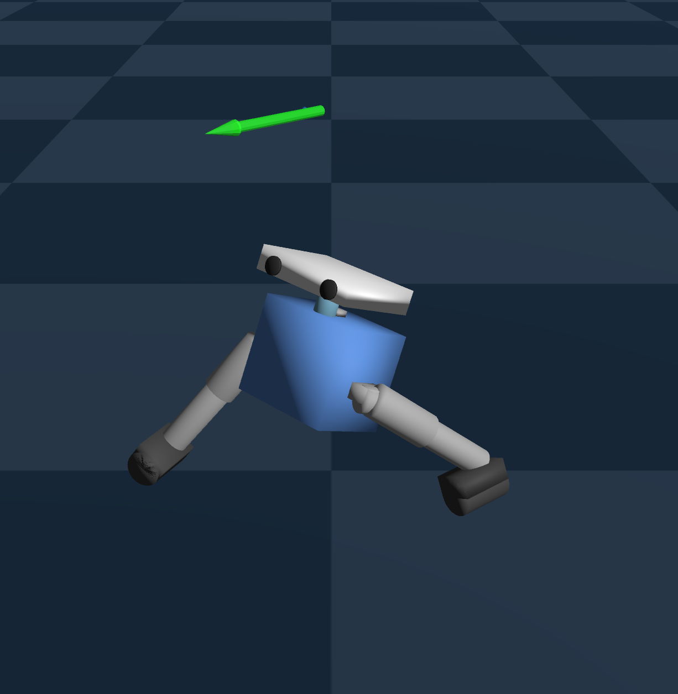
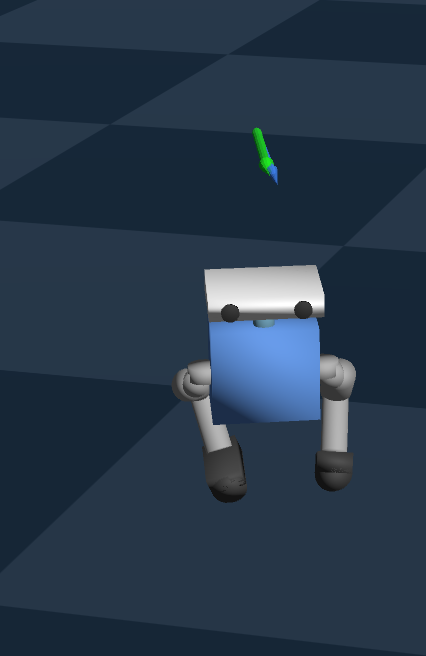
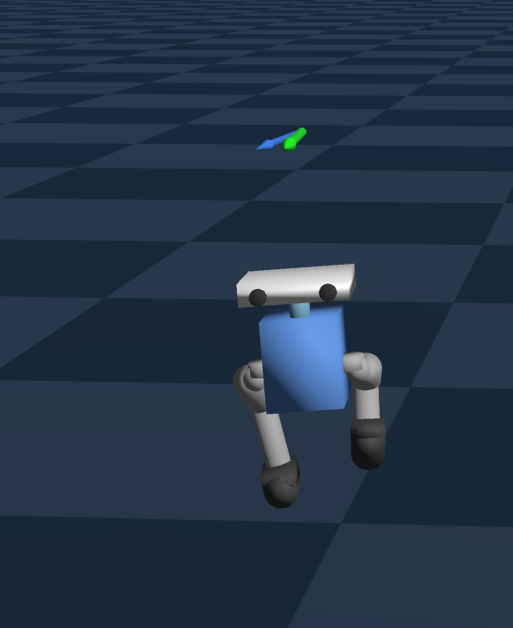
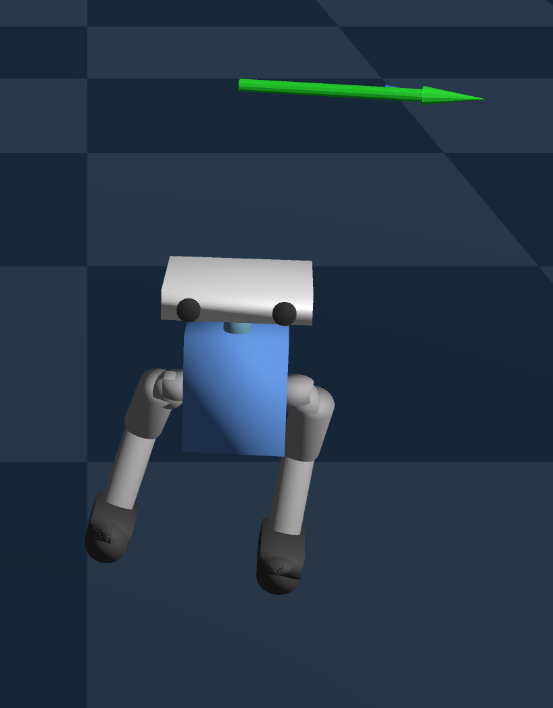

<!-- _class: title -->

# 二脚歩行ロボットの歩容獲得による強化学習入門

---

# 目次

0. **はじめに**
1. **強化学習（RL）による歩容獲得の概要**
2. **本実験シリーズのゴール設定**
3. **実験**
   - 3.1 ステップ1: 足先空間（Task-Space）アプローチ
   - 3.2 ステップ2: Unitree参考実装による関節空間制御
   - 3.3 ステップ3: 胴体幅縮小モデル（Narrow）
   - 3.4 ステップ4: 全方向速度コマンド対応（Omni）
4. **考察**
5. **VLAや他のPhysical AIの手法との関連**
6. **まとめ**

---

# 0. はじめに

- 本スライドは「強化学習（特にPPO）の入門」を目的に，二脚ロボットの**歩容獲得**を題材として整理しました．

- 題材にはDisney Researchが強化学習で歩容獲得を行っていた二脚ロボットを選びました．

- 実験は**物理シミュレータ上**で行い，観測・行動・報酬設計と学習安定化の勘所を，実例ベースでまとめています．

- 末尾では実験と独立して「VLAなど他モデルとの関連」に関するサーベイもご紹介します．

左: [Design and Control of a Bipedal Robotic Character](https://arxiv.org/html/2501.05204v1)から引用
右: 本実験で製作したURDFモデル

---

<!-- _class: title -->

# 1. 強化学習（RL）による歩容獲得の概要

---

# 強化学習とは

エージェントが **環境との相互作用** を通じて，**累積報酬を最大化** する行動方策（ポリシー）を学習する枠組み．

- **ポリシー**
  - 現在の状態に基づいて行動を与える機構
  - 今回はニューラルネットワークで実現
- **目的関数**: 次式の「期待値の最大化」を行う
  - $\max_\pi \mathbb{E}\left[\sum_{t=0}^{T} \gamma^t r_t\right]$

---

# 強化学習とは

**学習ループ**:
1. 現在の状態（姿勢・速度・関節角度）を**観測**
2. 方策に基づき**行動**（=角度指令など）を決定
3. シミュレータで1ステップ進め，**報酬**を取得
4. 方策を更新

---

# PPO アルゴリズム

## Proximal Policy Optimization（PPO）

方策更新の変化量をクリップして暴走を防ぎ，安定に性能を上げる強化学習アルゴリズム

$$L^{CLIP}(\theta) = \hat{\mathbb{E}}_t \left[ \min\left( r_t(\theta) \hat{A}_t,\ \text{clip}(r_t(\theta), 1-\epsilon, 1+\epsilon) \hat{A}_t \right) \right]$$

---

# PPO アルゴリズム

## Proximal Policy Optimization（PPO）

$$L^{CLIP}(\theta) = \hat{\mathbb{E}}_t \left[ \min\left( r_t(\theta) \hat{A}_t,\ \text{clip}(r_t(\theta), 1-\epsilon, 1+\epsilon) \hat{A}_t \right) \right]$$

### 各項の定性的解釈

- $r_t(\theta) = \frac{\pi_\theta(a_t|s_t)}{\pi_{\theta_{\text{old}}}(a_t|s_t)}$：**重要度比**．新旧方策の行動確率の比で，旧方策のデータから新方策の性能を推定（重要度サンプリング）
- $\hat{A}_t = Q^\pi(s,a) - V^\pi(s)$：**アドバンテージ関数**（GAE で推定）．行動 $a_t$ が平均的な行動に比べてどれだけ優れているかの相対評価量
- $\text{clip}(r_t, 1{-}\epsilon, 1{+}\epsilon)$：重要度比を $[1{-}\epsilon,\, 1{+}\epsilon]$ に切り詰め，方策の過度な更新を抑制．TRPO の KL 制約をシンプルに近似
- $\min(\cdot,\cdot)$：悲観的下限を選択．良い方向への過度な変化にはブレーキをかけつつ，悪化は制限せず修正を促す非対称設計

---

# PPO の特徴と本実験での設定

### PPO の特徴

- 重要度比のクリッピングにより，方策の更新幅を信頼領域内に制限（TRPO の KL 制約をシンプルに近似）
- 悲観的下限を最適化することで，パフォーマンス崩壊を防止し安定した単調改善を実現
- オンポリシー手法であり，GPU 並列環境による大規模バッチ収集と相性が良い

### 本実験での PPO 設定（rsl-rl）

| パラメータ | 設定値 | 備考 |
|-----------|--------|------|
| **NN 構造** | MLP [256, 256, 128] | Actor / Critic 共通 |
| **クリップ範囲 $\epsilon$** | 0.2 | 標準的な設定 |
| **ミニバッチ数** | 4 | |
| **学習エポック数** | 5 / update | 1回の rollout に対する更新回数 |
| **割引率 $\gamma$** | 0.99 | 長期的報酬を重視 |
| **GAE $\lambda$** | 0.95 | バイアス-分散トレードオフ |

---

# Genesis 物理シミュレータ

## Genesis とは

- **100% Python** 実装（フロントエンド・バックエンドとも）でフルスクラッチ開発された物理エンジン
- 剛体・関節体・流体など **多様な物理ソルバーを統一フレームワーク** に統合
- 最大**4300万FPS**を謳う超高速シミュレーション
- `pip install` のみで導入可能な **軽量設計** と直感的な API

引用: [Genesis Documentation — Locomotion](https://genesis-world.readthedocs.io/ja/latest/user_guide/getting_started/locomotion.html)

---
# Genesis 物理シミュレータ

## GPU 並列シミュレーションによる高速学習

### 本実験での環境
- **大規模バッチ処理**: 4096環境の GPU 並列実行による高速学習
- **制御周波数 50Hz**: 実機に合わせた制御ステップ設定が可能
- **行動遅延シミュレート**: sim-to-real ギャップの軽減が狙える

### 本実験での構成

| 要素 | 構成 |
|------|------|
| **RL アルゴリズム** | PPO（rsl-rl） |
| **物理エンジン** | Genesis |
| **並列環境数** | 4096 |
| **制御周波数** | 50 Hz（dt = 0.02s） |
| **モニタリング** | TensorBoard |
| **動作GPU** | M3 Apple Silicon or RTX4060Ti |

---

# 学習の構成要素

## 観測空間・行動空間・報酬の設計が重要

| 構成要素 | 内容 | 本実験での設計 |
|---------|------|---------------|
| **観測空間** | エージェントが受け取る情報 | 胴体速度・角速度，重力方向，関節角度/角速度，速度コマンド，歩容位相など（50次元） |
| **行動空間** | エージェントの出力 | 各関節の目標角度オフセット（10次元） |
| **報酬関数** | 行動の良さを定量化 | 速度追従，接地パターン，姿勢安定性など複数項目 |

**報酬設計のジレンマ**: 報酬項目を増やすと細かな制御が可能だが，**項目間の競合**が発生し学習が不安定化する

---

# 報酬設計の重要性

二脚歩行RLの成否は**報酬設計**で決まる

| カテゴリ | 目的 | 例 |
|---------|------|-----|
| **主報酬** | 前進を促す | 速度追従 (tracking_lin_vel) |
| **歩行品質** | 自然な歩容 | 接地パターン，交互歩行，歩幅 |
| **安定性** | 倒れない | 胴体姿勢，角速度抑制 |
| **ペナルティ** | 不自然な動作を抑制 | 高周波振動，関節偏位 |

- **バランスが重要**: ペナルティ > 主報酬 → 「何もしない」が最適解に

- **コツ**: まず主報酬だけで「前に動く」を確認 → ペナルティは小さく、1項目ずつ追加して寄与を見ながら調整

---

# 報酬設計の工夫

## 階層型報酬を重み付き加算で実現: $R = \sum_i w_i \cdot r_i(s,a) \cdot \Delta t$

定性的には「それぞれの報酬 $r_i$ を $w_i$ で重み付けして時間積分したものを総報酬とする」と解釈できる．（実際には離散系なので$\Delta t$を乗じて総和を取っている）

| 優先度 | 階層 | 役割 | スケール |
|:---:|------|------|--------:|
| 1 | **主報酬** | 何をさせたいか | +O(1)〜+O(10) |
| 2 | **歩行品質** | どう歩かせたいか | +O(0.1)〜+O(1) |
| 3 | **安定性** | 何を維持させたいか | -O(0.1)〜-O(10) |
| 4 | **ペナルティ** | 何をさせたくないか | -O(1e-7)〜-O(1) |

- **主報酬 > Σペナルティ実効値** を常に満たす
  → 「動かない」が最適解になるのを防ぐ
- 報酬項目数は **15〜17 項目** が扱いやすい
  → 20項目あたりで学習が不安定になった
- 歩行品質報酬は **歩行フェーズと連動** させる
  → 遊脚期・接地期で異なる報酬を適用

---

<!-- _class: title -->

# 2. 本実験シリーズのゴール設定

---

# 対象ロボット: ドロイド型二脚歩行ロボット

## 簡易3Dモデル

- Disney Reseachによる二脚ロボットの強化学習の論文で扱われた形状を用いる
- ディティールは削いだURDF形式の3Dモデルを作成
- `hip_yaw → hip_roll → hip_pitch → knee_pitch → ankle_pitch`の関節構成

左: [Design and Control of a Bipedal Robotic Character](https://arxiv.org/html/2501.05204v1)から引用

---

# ゴール設定 — 最終目標と評価指標

> **ゆったり自然に可愛く歩く** ドロイド型の二脚歩行ロボット

### 最終目標
1. ✅ 安定した **交互歩行** の獲得
2. ✅ 速度コマンド **追従** 能力
3. ✅ **全方向**（前後左右）への移動
4. 🔲 実機への **Sim2Real** 転移

### 定量的な評価指標

| 指標 | 意味 | 目安 |
|------|------|--------|
| **X 平均速度** | 前進速度の達成度 | 0.2〜0.3 m/s |
| **hip_pitch 相関** | 左右脚の交互性（-1で完全逆相） | -1.0 |
| **Yaw ドリフト** | 直進性 | 0° |
| **Roll / Pitch std** | 胴体の安定性 | 小さいほど良い |
| **片足接地率** | 歩行パターンの健全性 | > 90% |
| **penalty / positive 比** | 報酬構造の健全性 | < 0.15（注意域を避ける） |

**hip_pitch 相関 = -1.0** が理想的．左右の股関節が完全に逆位相で動く = 交互歩行

---

# 実験シリーズの全体像

### 4ステップの実験系譜

- **初期実験**: 動作確認用のURDFで関節空間制御の初期試行（V1〜V21）
- **ステップ1**: 足先空間アプローチ → 失敗
- **ステップ2**: Unitree参考実装で関節空間に復帰 → 報酬設計確立
- **ステップ3**: 胴体幅縮小モデル → 全指標大幅改善
- **ステップ4**: 全方向歩行への拡張 → 追従率65.0%（V19, 4方向平均）

---

<!-- _class: title -->

# 3. 実験

---

<!-- _class: title -->

# 3.1 ステップ1: 足先空間アプローチ
## FK/IKを併用する制御

---

# ステップ1: アイデアと設計

## 探索対象

- 行動空間の探索対象を次元削減して以下を狙う
  - 学習効率向上

### 関節空間 vs 足先空間

| | 関節空間 | 足先空間 |
|--|---------|---------|
| 行動次元 | 10（各関節角度） | 4（左右足先XZ） |
| 変換 | 不要 | IK が必要 |
| 探索対象 | 比較的大きい | 比較的小さい |

---

# ステップ1: アイデアと設計

## 指針

- FK/IK モジュールを事前に実装
- 行動空間: 左右足先XZ座標（4次元）を探索させる
- IKで関節角度に変換
- 「足をどこに置くか」がタスクの本質では？
   → 足先空間で直接探索させる

---

# ステップ1: 探索空間と観測空間（V26）

## 探索空間（Action）6次元

| 次元 | 内容 | 備考 |
|---:|---|---|
| 6 | 左右足先のXZ残差（4） + 左右hip_roll（2） | IKで目標角に変換 |
| | `[L_dx, L_dz, R_dx, R_dz]` | |
| | `[L_hip_roll, R_hip_roll]` | |

**計算リソース**: M3 MacBook Pro, RAM 36 GB
**学習時間**: 約20分 /試行

## 観測空間（Observation）41次元

| 次元 | 内容 |
|---:|---|
| 3 | base_ang_vel（角速度） |
| 3 | projected_gravity（重力方向） |
| 3 | commands（`v_x, v_y, ω_yaw`） |
| 10 | dof_pos - default（関節角偏差） |
| 10 | dof_vel（関節角速度） |
| 6 | last actions（前回アクション） |
| 2 | gait_phase sin/cos |
| 4 | current_foot_pos（左右足先XZ） |

---

# ステップ1: 結果

## 動作の様子(v26)

- 両足を大きく開いて突っ張って立つ
- 細かく振動して動いていく

---

# ステップ1: 結果

## V22〜V26: 段階的な失敗と分析（抜粋）

| Version | アプローチ | 結果 |
|---------|-----------|------|
| V22-V23 | 正弦波ベース軌道 + Residual Policy | ❌ 足が地面に届かない（16.8cm 浮遊） |
| V24 | End-to-End（直接足先位置学習） | ❌ 静止が最適解（alive + height > tracking） |
| V25 | 報酬バランス改善 | ❌ 脚が八の字に開く（hip_roll 0〜91°） |
| V26 | hip_roll を行動空間に追加 | ❌ 震え・接地率 0% 継続 |

---

# ステップ1: 失敗分析と教訓

### 失敗の根本原因

| 症状 | 原因 | 教訓 |
|------|------|------|
| 八の字開脚 | IK=hip_roll=0 だがPD追従失敗 | IK精度問題は致命的 |
| 高周波振動 | 報酬を微振動でexploit | action_rate ペナルティ必須 |
| Yaw drift | L/R非対称な関節動作 | 対称性の制約が必要 |
| 接地 0% | 上記の複合 | 基本動作ができなければ学習不可 |

### 先行研究サーベイの結論

> 成功事例の **大部分が関節空間制御** を採用
> - Cassie RL（UC Berkeley）
> - Humanoid-Gym
> - Unitree RL Gym
> - Legged Gym（ETH）

**結論**: 足先空間アプローチは先行研究でも成功例が少なく，**関節空間制御に回帰** → ステップ2 へ

---

# ステップ1 V26: 報酬一覧（droid-walking-v26）

`reward_scales`（V26で最終的に試した構成）

| カテゴリ | 項目名 | scale |
|---|---|---:|
| 主報酬 | tracking_lin_vel | +5.0 |
| 主報酬 | tracking_ang_vel | +0.5 |
| 主報酬 | forward_progress | +3.0 |
| 歩行品質（正） | foot_height_diff | +1.0 |
| 歩行品質（正） | hip_pitch_alternation | +0.5 |
| 歩行品質（正） | gait_cycle | +2.0 |
| 生存 | alive | +0.1 |
| 終了 | termination | -100.0 |

| カテゴリ | 項目名 | scale |
|---|---|---:|
| 安定性（負） | orientation | -1.0 |
| 安定性（正） | base_height | +0.5 |
| 安定性（負） | lin_vel_z | -0.5 |
| 安定性（負） | ang_vel_xy | -0.05 |
| エネルギー（負） | torques | -1e-5 |
| エネルギー（負） | dof_vel | -1e-4 |
| エネルギー（負） | dof_acc | -1e-5 |
| エネルギー（負） | action_rate | -0.1 |
| 姿勢（負） | hip_roll_penalty | -1.0 |

---

<!-- _class: title -->

# 3.2 ステップ2: 関節空間での探索
## 関節空間制御による歩容獲得（V1〜V40）

---

# ステップ2: 背景と目的

## Unitree RL Gym の知見を転用

### Unitree G1/H1 の成功要因
- **関節空間制御**（=足先空間ではない）
- **歩行フェーズ報酬**（接地/遊脚パターン）
- **13〜14 項目** のバランスの取れた報酬設計

### 転用にあたっての課題

| | Unitree G1 | 対象ロボット |
|--|-----------|-----------|
| 脚 DOF | 12 | 10 |
| 膝構造 | 通常 | **逆関節** |
| 質量 | 30-50 kg | 5.8 kg |
| 胴体高 | 0.78 m | 0.19 m |

→ 報酬スケールの大幅な調整が必要

---

# ステップ2: 探索空間と観測空間（Unitree方式）

## 探索空間（Action）10次元

| 次元 | 内容 |
|---:|---|
| 10 | 各関節の目標角度オフセット（関節空間） |

## 学習環境

**計算リソース**: M3 MacBook Pro, RAM 36 GB
**学習時間**: 約20分 /試行

## 観測空間（Observation）50次元

| 次元 | 内容 |
|---:|---|
| 3 | base_lin_vel（ボディ線速度） |
| 3 | base_ang_vel（ボディ角速度） |
| 3 | projected_gravity（重力方向） |
| 3 | commands（`v_x, v_y, ω_yaw`） |
| 10 | dof_pos - default（関節角偏差） |
| 10 | dof_vel（関節角速度） |
| 10 | last actions（前回アクション） |
| 2 | gait_phase sin/cos |
| 2 | leg_phase（左右脚位相） |
| 2 | feet_pos_z（左右足先高さ） |
| 2 | contact_state（左右接地） |

---

# ステップ2: 結果

## 動作の様子(v40)

- 小刻みに震えながら歩く
- 片足でバランスを取る
- これはこれで可愛い（が目標にしている動きではない）

---

# ステップ2: 40バージョンの反復改善

## 試行錯誤の軌跡（主要マイルストーン）

**序盤（V1〜V5）**: 静止ポリシー問題
- V1-V2: Unitree直接適用 → 静止
- V3: velocity_deficit（目標速度への不足分に罰）追加  → 初の前進 0.15 m/s 達成

**中盤（V6〜V20）**: 歩行品質改善
- V7-V10: 報酬項目増加（22項目）→ 静止に回帰
- V11: 最小有効報酬セット（15項目）→ 0.21 m/s 復活
- V20: Genesis Contact Sensor 導入 → 接地検出問題を根本解決，片足接地率 91.4% 達成

**後半（V21〜V40）**: 課題の精密解決
- V27-V28: エネルギーペナルティ緩和 → hip_pitch相関 -0.95（過去最高）
- V32: Yawドリフト改善 → -2.00°
- V35: タップダンス歩容の根本原因特定・解消
- V38-V39: Roll/Pitch安定性改善

---

# ステップ2: 主要な発見

## 報酬設計の原則（40バージョンから抽出）

### ✅ 効果があった施策
- **velocity_deficit**: 静止の回避
- **Contact Sensor**: Z座標閾値に代わる信頼できる接地検出
- **エネルギーペナルティ緩和**: hip_pitch 相関の改善
- **swing_contact_penalty=-0.7**: タップダンス歩容の解消

### ❌ 避けるべきパターン

| パターン | 結果 |
|---------|------|
| 報酬 22 項目超 | 静止ポリシー |
| symmetry 報酬 | hip_pitch 同期（逆効果） |
| ペナルティ累積 | 「動かない」が最適 |
| hip_pos compound | hip_yaw+roll 同時制約 → 独立制御不能 |

**最重要教訓**: 報酬項目は *15〜17 項目* が扱いやすい．増やすほど *相互干渉リスク* が増大する．

---

# ステップ2: 主要な課題と解決策

| 課題 | 原因 | 解決策 | 確認Ver |
|------|------|--------|--------|
| 静止ポリシー | ペナルティ > 主報酬 | velocity_deficit 追加 | V3 |
| タップダンス | feet_air_time の first_contact 構造 | swing_contact_penalty=-0.7 | V35 |
| Yawドリフト | hip_yaw L/R非対称 | hip_pos + ang_vel_xy | V32, V38 |
| Roll揺れ | hip_roll mean offset | ang_vel_xy=-0.1 | V38 |
| 報酬肥大化 | 21+ 項目で不安定 | 15-17 項目に枝打ち | V36 |

---

# ステップ2: 最終到達点

**確立された報酬構成**: 
- 17項目（V41案）— 主報酬 2 + 歩行品質 5 + 安定性 4 + 関節制御 2 + ペナルティ 4

**残された課題**: 
- Yaw ドリフト
- 小刻みな歩容

---

# ステップ2 V39: 報酬一覧（droid-walking-unitree-v39）

`reward_scales`（非ゼロのみ列挙。scale=0 は無効化）

| カテゴリ | 項目名 | scale |
|---|---|---:|
| 主報酬 | tracking_lin_vel | +1.5 |
| 主報酬 | tracking_ang_vel | +0.5 |
| 歩行品質（正） | swing_duration | +2.0 |
| 歩行品質（正） | contact | +0.4 |
| 歩行品質（正） | single_foot_contact | +0.5 |
| 歩行品質（正） | step_length | +0.8 |

| カテゴリ | 項目名 | scale |
|---|---|---:|
| 安定性（負） | lin_vel_z | -2.0 |
| 安定性（負） | ang_vel_xy | -0.1 |
| 安定性（負） | orientation | -0.5 |
| 安定性（負） | base_height | -5.0 |
| 歩行品質（負） | swing_contact_penalty | -0.7 |
| 歩行品質（負） | feet_swing_height | -8.0 |
| 歩行品質（負） | contact_no_vel | -0.1 |
| 歩行品質（負） | hip_pos | -0.8 |
| 歩行品質（負） | velocity_deficit | -0.5 |
| エネルギー（負） | action_rate | -0.005 |
| エネルギー（負） | swing_foot_lateral_velocity | -0.5 |

---

<!-- _class: title -->

# 3.3 ステップ3: 胴体幅縮小モデル
## 対象ロボット 簡易モデル V2（V1〜V25）

---

# ステップ3: 背景と設計

## 簡易モデル V2 の導入

### 形態変更の動機
ロール方向揺れや足が胴体内側に入り込む動きが課題
→ 脚間隔に対する胴体幅の大きすぎる？
→『元論文のドロイドはもっとスリムだったのでは？」

### 変更箇所

| 項目 | V1（ステップ2） | V2（ステップ3） | 変更率 |
|------|-------------|-------------|--------|
| 胴体幅 | 0.18 m | **0.135 m** | 75% |
| 股関節間隔 | 0.10 m | **0.075 m** | 75% |
| 胴体慣性 izz | 0.04 | **0.029** | 73% |

### 期待される効果

1. **脚間隔の縮小**
   → 横方向支持基底面が変化
2. **回転慣性の低下**
   → Yaw 方向の制御が容易に
3. **コンパクトな体型**
   → より自然な歩行姿勢

---

# ステップ3: 背景と設計

## モデルの外観比較

変更前

変更後

---

# ステップ3: 結果

## 動作の様子(v25)

- ゆったり歩いて可愛い歩行
- yawドリフトもかなり改善
- 前進だけを行うポリシーとしては合格点

---

# ステップ3: 探索空間と観測空間（Narrowモデル）

## 探索空間（Action）10次元

| 次元 | 内容 |
|---:|---|
| 10 | 各関節の目標角度オフセット（関節空間） |

Narrow（簡易モデルV2）では **形態だけ変更** し、観測/行動設計は維持する。

## 学習環境

**計算リソース**: M3 MacBook Pro, RAM 36 GB
**学習時間**: 約20分 /試行

## 観測空間（Observation）50次元

| 次元 | 内容 |
|---:|---|
| 3 | base_lin_vel（ボディ線速度） |
| 3 | base_ang_vel（ボディ角速度） |
| 3 | projected_gravity（重力方向） |
| 3 | commands（`v_x, v_y, ω_yaw`） |
| 10 | dof_pos - default（関節角偏差） |
| 10 | dof_vel（関節角速度） |
| 10 | last actions（前回アクション） |
| 2 | gait_phase sin/cos |
| 2 | leg_phase（左右脚位相） |
| 2 | feet_pos_z（左右足先高さ） |
| 2 | contact_state（左右接地） |

---

# ステップ3: 25バージョンの反復改善

## 内股問題とPDクランプの発見

**Phase 1 (V1-V7)**: 報酬チューニング
- hip_pos分離（hip_yaw_pos新設）
- 接地相限定hip_rollペナルティ
- Roll std: 6.72° → **3.54°** (V6)

**Phase 2 (V8-V14)**: 内股問題の解消
- V13-V14: PDターゲットクランプ導入
- 内股: ±25° → **±12°** (V14)
- hip_pitch相関: **-0.800** (V14)

**Phase 3 (V15-V21)**: 速度・安定性の向上
- 歩行周波数の調整: 0.88 → **1.25 Hz** (V20)
- X速度: 0.158 → **0.312 m/s** (V20)
- hip_pitch相関: **-0.877** (V20, 史上最高)
- Yaw: **+0.05°** (V20, ほぼ0°)

**Phase 4 (V22-V25)**: 微調整
- ankle_pitch Kd=5 による制振

---

# ステップ3: 主要な発見

## PD ターゲットクランプと歩行周波数の効果

### PD ターゲットクランプ（V13-V14）
- hip_roll の PD 目標値をハード制限
- Genesis の関節リミット（ソフト制約）を補完
- **内股 ±25° → ±12°** に大幅改善
- 報酬整形では不可能な **物理的制約**
- hip_pitch相関: **-0.800** (V14)

### 歩行周波数 1.2Hz（V20）
gait_frequency を 0.9 → 1.2Hz に変更

| 指標 | 0.9Hz | 1.2Hz | 改善 |
|------|-------|-------|------|
| X 速度 | 0.255 | **0.312** | +22% |
| corr | -0.619 | **-0.877** | +42% |
| Yaw | -16.1° | **+0.05°** | ≈0° |
| lateral | 58mm | **27mm** | -53% |

→ 胴体サイズに応じたちょうど良い歩行周波数を見つけ出す必要がある

---

# ステップ3: V25 最終ベースライン性能

| 指標 | V25 値 | ステップ2 V39 | 改善率 |
|------|--------|------------|--------|
| X 速度 | 0.304 m/s | 0.122 m/s | **+149%** |
| hip_pitch 相関 | -0.851 | -0.588 | **+45%** |
| Yaw ドリフト | +2.40° | -19.17° | **-87%** |
| Roll std | 4.44° | 6.06° | **-27%** |
| 内股角度 | ±9.3° | ±25°以上 | **大幅改善** |
| 歩行周波数 | 1.25 Hz | 0.88 Hz | 安定 |

ステップ2 から *すべての指標で大幅改善*．胴体形態の最適化 + PD クランプ + 歩行周波数チューニングの複合効果．

---

# ステップ3 V25: 報酬一覧（droid-walking-narrow-v25）

| カテゴリ | 項目名 | scale |
|---|---|---:|
| 主報酬 | tracking_lin_vel | +1.5 |
| 主報酬 | tracking_ang_vel | +0.5 |
| 歩行品質（正） | swing_duration | +2.0 |
| 歩行品質（正） | contact | +0.4 |
| 歩行品質（正） | single_foot_contact | +0.5 |
| 歩行品質（正） | step_length | +0.8 |

| カテゴリ | 項目名 | scale |
|---|---|---:|
| 安定性（負） | lin_vel_z | -2.0 |
| 安定性（負） | ang_vel_xy | -0.1 |
| 安定性（負） | orientation | -2.0 |
| 安定性（負） | base_height | -5.0 |
| 歩行品質（負） | swing_contact_penalty | -0.7 |
| 歩行品質（負） | feet_swing_height | -4.0 |
| 歩行品質（負） | contact_no_vel | -0.1 |
| 歩行品質（負） | hip_yaw_pos | -0.8 |
| 歩行品質（負） | velocity_deficit | -0.5 |
| 歩行品質（負） | foot_lateral_velocity | -0.5 |
| 歩行品質（負） | base_vel_y | -1.0 |
| エネルギー（負） | action_rate | -0.005 |

---

<!-- _class: title -->

# 3.4 ステップ4: 全方向速度コマンド対応（Omni）
## 前後左右 + Yaw旋回（V1〜V19+）

---

# ステップ4: 目標

## 前進のみのポリシーから全方向移動へ

### 背景

ステップ3 は **前進のみ** を学習：
- `lin_vel_x_range: [0.25, 0.35]`
- `lin_vel_y_range: [0, 0]`

ステップ4 では **全方向** に拡張：
- `lin_vel_x_range: [-0.3, 0.35]`
- `lin_vel_y_range: [-0.30, 0.30]`
- `ang_vel_yaw_range: [-0.3, 0.3]` (V19〜)

### 新たな技術要素

1. **is_moving 判定のバグ修正**（V4）
   - X方向のみ → XYノルムで判定
2. **Mirror Augmentation**（V13〜）
   - L↔R 反転データで対称性を強制
3. **gait_phase ミラー変換**（V14）
   - 位相の整合性を維持

---

# ステップ4: 探索空間と観測空間（Omni）

## 探索空間（Action）10次元

| 次元 | 内容 |
|---:|---|
| 10 | 各関節の目標角度オフセット（関節空間） |

ここでもv2, v3と同じく観測/行動設計は維持する

## 学習環境

**計算リソース**: RTX4060Ti, VRAM 16 GB
**学習時間**: 約40分 /試行
（v3までのMBPでは約2.5時間 /試行かかる）

## 観測空間（Observation）50次元

| 次元 | 内容 |
|---:|---|
| 3 | base_lin_vel（ボディ線速度） |
| 3 | base_ang_vel（ボディ角速度） |
| 3 | projected_gravity（重力方向） |
| 3 | commands（`v_x, v_y, ω_yaw`） |
| 10 | dof_pos - default（関節角偏差） |
| 10 | dof_vel（関節角速度） |
| 10 | last actions（前回アクション） |
| 2 | gait_phase sin/cos |
| 2 | leg_phase（左右脚位相） |
| 2 | feet_pos_z（左右足先高さ） |
| 2 | contact_state（左右接地） |

---

# ステップ4: 結果

## 動作の様子(v19)

全方位移動が可能になったため，固定値ではなくゲームパッド（Logicool F710）からの入力で動作させる．

- 並進移動: 自在な向きの目標速度を入力可能に
- yaw回転: ゲームパッドの入力に従ってその場旋回
- 微調整の余地はあるが，一定動作している．

右図は画面右方向へ移動する様子

---

# ステップ4: 19バージョンの反復改善

Omniでは commands を **全方向**（前後・横移動・Yaw旋回）でサンプリングし、追従タスクを拡張する。

## 全方向歩行の獲得過程

- **V1**: ステップ3ベースラインから全方向対応へ拡張
- **V4**: is_moving 判定バグ修正（X→XYノルム）
- **V6-V8**: action_rate ペナルティ調整
- **V13-V14**: Mirror Augmentation 導入・gait_phase 修正

- **V15**: 横方向コマンド範囲拡大
- **V16-V18**: Kd 調整・検証
- **V19**: Yaw 旋回コマンド導入

---

# ステップ4: Mirror Augmentation の効果と落とし穴

### Mirror Augmentation とは
- 観測・行動の **L↔R を反転** したデータを生成
- 同一エピソードから **2倍のサンプル** を獲得
- 左右対称な方策を促す

### 効果（V14）
- hip_pitch 非対称度: +28.5% → **+9.8%**
- 姿勢安定性: Roll std **-24%**, Pitch std **-40%**
- FWD 追従率: **93.2%**

### 注意点
- **gait_phase のミラー変換漏れ**（V13 バグ）
  → Yaw ドリフト 7.3 倍悪化
- **確率的ミラー**（V17）は PPO のアドバンテージ推定と干渉
  → 追従率低下
- 永続ミラー（毎ステップ適用）が安定

---

# ステップ4 V19: 方向別追従率

| 方向 | コマンド範囲 | 追従率 |
|------|------------|--------|
| FWD（前進） | [0.25, 0.35] m/s | **82.2%** |
| BWD（後退） | [-0.30, -0.20] m/s | 73.6% |
| LFT（左移動） | [-0.30, -0.15] m/s | 52.8% |
| RGT（右移動） | [0.15, 0.30] m/s | 51.2% |
| **平均** | | **65.0%** |

Yawコマンド導入（V19）により **Yawドリフト改善と方向間ばらつき改善** を達成した一方，追従率は **平均65.0%** まで低下（特にRGTがボトルネック）．

---

# ステップ4 V19: 報酬一覧（exp009-omni-v19）

`reward_scales`（非ゼロのみ列挙。scale=0 は無効化）

| カテゴリ | 項目名 | scale |
|---|---|---:|
| 主報酬 | tracking_lin_vel | +1.5 |
| 主報酬 | tracking_ang_vel | +0.5 |
| 歩行品質（正） | swing_duration | +2.0 |
| 歩行品質（正） | contact | +0.4 |
| 歩行品質（正） | single_foot_contact | +0.5 |
| 歩行品質（正） | step_length | +0.8 |

| カテゴリ | 項目名 | scale |
|---|---|---:|
| 安定性（負） | lin_vel_z | -2.0 |
| 安定性（負） | ang_vel_xy | -0.1 |
| 安定性（負） | orientation | -2.0 |
| 安定性（負） | base_height | -5.0 |
| 歩行品質（負） | swing_contact_penalty | -0.7 |
| 歩行品質（負） | feet_swing_height | -4.0 |
| 歩行品質（負） | contact_no_vel | -0.1 |
| 歩行品質（負） | hip_yaw_pos | -0.8 |
| 歩行品質（負） | velocity_deficit | -0.1 |
| 歩行品質（負） | foot_lateral_velocity | -0.5 |
| エネルギー（負） | action_rate | -0.01 |

---

<!-- _class: title -->

# 4. 考察

---

# 行動空間の選択 — 制御空間の比較

| アプローチ | 実験 | 結果 | 評価 |
|-----------|------|------|------|
| 関節空間（10 DOF） | 初期実験, ステップ2 | 歩行獲得に成功 | **推奨** |
| 足先空間（4 DOF） | ステップ1 | 全バージョン失敗 | 非推奨 |
| 関節空間 + 報酬改善 | ステップ3, ステップ4 | 高品質歩行 | **最良** |

**結論**: 先行研究（Unitree, Cassie, Humanoid-Gym）と一致し，**関節空間制御が二脚歩行RLには向いている**

（犬型のような四脚ロボットで，なおかつホビーサイズの超小型であれば足先空間の方が有利なこともあるらしい）

---

# 報酬設計の原則

## 各実験を通じた学び

### 原則

1. **報酬項目数は 15-17 が扱いやすい** — 20超では不安定化（ステップ2 V7-V10）
2. **主報酬 > ペナルティ合計** — 違反すると静止ポリシーに収束
3. **1変更1検証** — 複数変更の同時投入は効果分離不可能
4. **構造的問題は報酬チューニングでは解決不可** — PDゲインや制御対象の物理的な構造そのものの変更が必要な場合がある

### 物理的制約 vs 報酬整形
- 内股問題: 報酬で解消不可 → **PDクランプ**で解決
- かかと叩き: 報酬で解消不可 → **関節Kd調整**で解決
- 教訓: *根本原因が制御系にある問題は報酬で解決できない*

### 形態設計の重要性
- 胴体幅 75% 縮小で全指標改善
- HW設計と学習は *不可分*

---

# ロボット形態の改善効果

ステップ2 → ステップ3 で胴体幅を 75% に縮小した効果:

| 改善点 | メカニズム |
|--------|----------|
| **Yaw安定性** (+0.05°) | 胴体慣性 izz 低下による回転モーメント減少 |
| **Roll安定性** (std -25%) | 脚間隔縮小による支持基底面最適化 |
| **X速度** (+75%) | 横方向制約緩和により前進にリソース集中 |
| **歩行品質** (corr -0.877) | コンパクトな体型による自然な脚振り |

→ **HWア設計と報酬設計の共同最適化**が重要

---

# スケーラビリティと Sim2Real への展望

### 達成したこと
- ✅ 前進 0.31 m/s（目標の 90%+）
- ✅ 交互歩行（hip_pitch corr -0.877）
- ✅ Yaw ドリフト ≈ 0°
- ✅ 全方向移動（追従率 65.0% @V19）

### 残された課題

- 🔲 Sim2Real 転移

### Sim2Real への準備
- **Domain Randomization**: 摩擦・質量等の変動
- **ゲインチューニング**: 実機モータ特性への適合

---

<!-- _class: title -->

# 5. VLAや他のPhysical AIの手法との関連
## 強化学習を組み合わせた性能向上事例のサーベイ

---

# VLA + RL

## Vision-Language-Action モデルと強化学習の融合

近年，ロボット制御においてVLA（Vision-Language-Action）モデルや大規模基盤モデルが急速に発展している．これらの手法と強化学習を組み合わせることで，単独では達成困難な性能向上が報告されている．

| カテゴリ | 手法の概要 | RLの役割 | 代表文献 |
|---------|-----------|---------|---------|
| **VLA + RL FT** | 事前学習済みVLAをRLで追加学習 | 模倣学習の限界を突破 | [π\*₀.₆ (Physical Intelligence, 2025)](https://arxiv.org/abs/2511.14759), [VLAC (Zhai+, 2025)](https://arxiv.org/abs/2509.15937) |
| **VLM/LLM 報酬設計** | 大規模言語/視覚モデルで報酬関数を自動生成 | 報酬設計の自動化 | [ARCHIE (Turcato+, 2025)](https://arxiv.org/abs/2503.04280), [RE-GoT (Yao+, 2025)](https://arxiv.org/abs/2509.16136) |
| **基盤モデル + Sim-to-Real** | 基盤VLM/LLMの知識移転＋行動（VLA）化 | 方策の事前学習 | [RT-2 (Brohan+, 2023)](https://arxiv.org/abs/2307.15818), [Radosavovic+, 2024](https://doi.org/10.1126/scirobotics.adi9579) |

---

# VLA + RL ファインチューニング

## 模倣学習の限界をRLで突破

### π\*0.6（Physical Intelligence, 2024-2025）

- **π\*0.6**: RECAP（RL with Experience and Corrections via Advantage-conditioned Policies）を導入
- **RLの役割**: デモ・オンポリシー収集・テレオペ介入など異種データを統合した advantage conditioning による自己改善
- **成果**: 家庭での洗濯物折り畳み，箱組み立て等を実現．タスクスループット *2倍* に向上

### VLA-RFT（OpenHelix, 2025）

- 軌跡レベル密報酬を用い，模倣学習の複合誤差問題に対処
- **成果**: わずか400ステップのファインチューニングで教師あり学習ベースラインを超越．成功率 86.6% → *91.1%*

**共通の知見**: 模倣学習（Behavior Cloning）単体では複合誤差が蓄積する．RLファインチューニングにより自己修正能力が獲得され，未知状況への頑健性が向上する．

---

# サーベイまとめ — 本実験の位置づけと今後の展望

### 本実験の位置づけ

本実験は **Sim-to-Real RL** パラダイムに属し，以下の点で先行研究と共通する:

- GPU 並列シミュレーション（Genesis ≈ Isaac Gym）
- PPO による方策学習
- 報酬設計による歩行品質制御
- Domain Randomization による転移準備

### 今後の発展可能性

| 技術 | 期待される効果 |
|------|--------------|
| **VLM 報酬設計** | 報酬チューニング工数の削減 |
| **Causal Transformer** | 環境適応能力の向上 |
| **VLA 統合** | 言語指示による歩行制御 |
| **Diffusion Policy** | より滑らかな行動生成 |

**結論**: RL は Physical AI の基盤技術として不可欠であり，VLA/LBM との融合により「大規模事前学習 + RL ファインチューニング」の二段階パラダイムが確立しつつある．本実験で蓄積した RL 歩行学習の知見は，この潮流の中で有用である．

---

<!-- _class: title -->

# 6. まとめ

---

# 実験成果

### 主要な貢献

1. **報酬設計原則の確立**
   - 15〜17 項目，ペナルティ < 主報酬
2. **制御対象の変更も含む最適化**
   - 報酬整形の限界を物理制約で補完
3. **Mirror Augmentation の実用知見**
   - 永続適用が安定，gait_phase 変換必須
4. **1変更1検証の有効性**
   - 系統的な探索

### 実験の流れ

---

# 性能サマリー（最良値）

### 達成事項

- **90+ バージョン**の反復実験
- 報酬設計原則の体系的確立
- **関節空間制御**の優位性を実証
- 胴体幅縮小による改善効果を定量的に検証
- 全方向コマンド追従歩行の基盤確立
- **追従率 65.0%**（V19, 4方向平均）

### 性能一覧

| 指標 | 値 |
|------|-----|
| 前進速度 | 0.312 m/s |
| Yawドリフト | +0.05° |
| Roll std | 4.18° |
| Pitch std | 0.82°〜1.00° |
| hip_pitch相関 | -0.877 |
| 片足接地率 | > 91% |
| penalty/positive | 0.070〜0.079 |

---

# サーベイから得た知見

## 本実験の位置づけと発展の方向性

### 本実験の位置づけ

- **Sim-to-Real RL** パラダイムに属する
  - GPU 並列シミュレーション（Genesis）
  - PPO による方策学習
  - 報酬設計による歩行品質制御
- 先行研究（UC Berkeley 人型歩行，Unitree RL 等）と同じ枠組み

### サーベイで確認した主要トレンド

| トレンド | 代表手法 |
|---------|---------|
| VLA + RL ファインチューニング | π\*0.6, VLA-RFT, VLAC |
| VLM/LLM による報酬自動設計 | ARCHIE, RE-GoT, VLAC |
| 基盤モデル + Sim-to-Real | RT-2, OpenVLA, GR00T |
| 大規模行動モデル（LBM） | TRI + Boston Dynamics |

**結論**: 「大規模事前学習 + RL ファインチューニング」の二段階パラダイムが確立しつつあり，本実験で蓄積した RL 歩行学習の知見はこの潮流の中で有用と考えられる．

---

# 今後の方向性

1. **Yaw旋回コマンドの調整**（ステップ4 V19〜）
   - 全方向 + 旋回のフルスペック歩行
2. **歩行品質の定性的改善**
   - 内股解消（hip_roll offset の根本対策）
   - ゆったり大股歩行の実現
3. **Sim2Real（シミュレーション→実機転送）**
   - 実アクチュエータへの適合
   - Domain Randomizatonによるロバスト性の向上

---

# 全体サマリー

| 章 | 要点 |
|---|------|
| **1. RL概要** | エージェントが環境との相互作用で方策を学習．PPO（クリップ付き方策勾配）+ Genesis（GPU並列4096環境）で高速学習 |
| **2. ゴール設定** | ドロイド型二脚ロボットの「ゆったり自然に可愛く歩く」歩容獲得．評価指標: 速度・hip_pitch相関・Yawドリフト・接地率等 |
| **3.1 ステップ1** | 足先空間（4DOF）アプローチ → IK精度・報酬exploit等で全バージョン失敗．先行研究も関節空間が主流と判明 |
| **3.2 ステップ2** | Unitree参考実装で関節空間（10DOF）に回帰．40版の反復で報酬設計原則を確立（15〜17項目，主報酬>ペナルティ） |
| **3.3 ステップ3** | 胴体幅75%縮小＋PDクランプ＋歩行周波数調整で全指標大幅改善（速度+149%, Yaw -87%, corr -0.877） |
| **3.4 ステップ4** | 全方向移動に拡張．Mirror Augmentation導入．4方向平均追従率65.0%．ゲームパッド操作に対応 |
| **4. 考察** | 関節空間制御の優位性，報酬設計原則（項目数・主報酬優位・1変更1検証），形態と学習の共同最適化の重要性 |
| **5. VLA+RL** | VLA+RLファインチューニング（π\*0.6等），VLM報酬自動設計（ARCHIE等）が台頭．RLは基盤技術として不可欠 |
| **6. まとめ** | 90+版の反復実験で報酬設計原則を体系化．今後はSim2Realと全方向歩行品質の向上を目指す |

