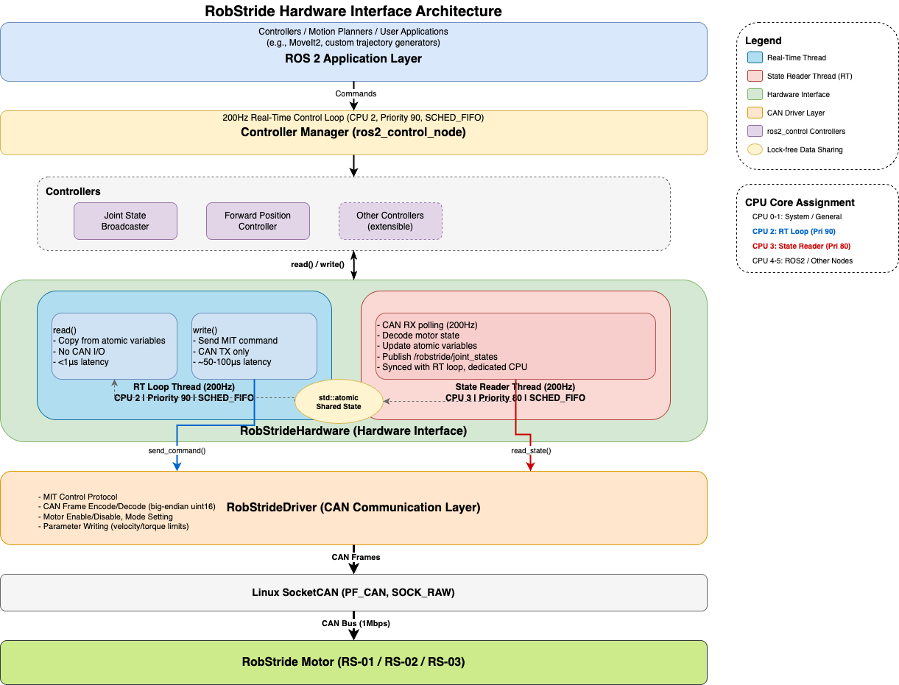

# RobStride Hardware Interface

ROS 2用のRobStride社製モーター（RS-01, RS-02, RS-03）用Hardware Interfaceパッケージ

## 目次

- [概要](#概要)
- [機能](#機能)
- [システム要件](#システム要件)
- [インストール](#インストール)
- [使い方](#使い方)
- [設定](#設定)
- [アーキテクチャ](#アーキテクチャ)
- [技術詳細](#技術詳細)
- [トラブルシューティング](#トラブルシューティング)

## 概要

`robstride_hardware`は、RobStride社製アクチュエーター（RS-01, RS-02, RS-03）をROS 2のros2_controlフレームワークで制御するためのハードウェアインターフェースパッケージです。

### 特徴

- **リアルタイム制御対応**: 200Hzのリアルタイムループで高速制御
- **非同期状態読み取り**: 100Hzの専用スレッドでモーター状態を読み取り、RTループへの影響を最小化
- **MITモード対応**: 位置・速度・トルクを統合制御可能なMIT control protocolに対応
- **ROS 2標準準拠**: ros2_controlフレームワークに完全準拠し、既存のコントローラーと互換
- **プラグインアーキテクチャ**: pluginlibを使用した動的ロードに対応

## 機能

### サポートしている制御モード

- **位置制御**: 目標位置への追従制御（MITモードのPD制御）
- **速度制御**: 目標速度への追従制御
- **トルク制御**: 目標トルクへの追従制御
- **インピーダンス制御**: Kp, Kd ゲインを調整可能

### 通信インターフェース

- **CAN通信**: Linux SocketCANを使用した高速CAN通信
- **拡張CANフレーム**: 29-bit IDを使用したRobStride独自プロトコル
- **双方向通信**: コマンド送信と状態フィードバックの同時処理

## システム要件

### ハードウェア

- Linux対応CANインターフェース（CAN-USBアダプター等）
- RobStride社製モーター（RS-01, RS-02, RS-03）
- 適切な電源供給（モーターの仕様に応じて）

### ソフトウェア

- Ubuntu 22.04 (Jammy Jellyfish)
- ROS 2 Humble Hawksbill以降
- Linux kernel 5.15以降（SocketCAN対応）
- SocketCAN utilities (`can-utils`)

## インストール

### 1. 依存パッケージのインストール

```bash
# CAN通信ツール
sudo apt install can-utils
```

### 2. パッケージのビルド

```bash
cd ~/ros2_ws
pixi run colcon build --packages-select robstride_hardware
```

### 3. CANインターフェースの設定

```bash
# CANインターフェースの起動（ビットレート1Mbps）
sudo ip link set can1 type can bitrate 1000000
sudo ip link set can1 up

# 確認
ip -details link show can0
```

## 使い方

### 基本的な起動手順

#### 1. ハードウェアインターフェースの起動

```bash
pixi run ros2 launch robstride_hardware bringup.launch.py
```

このコマンドで以下が起動します:
- Controller Manager（ros2_control_node）
- Robot State Publisher
- Joint State Broadcaster
- Forward Position Controller

#### 2. モーターの状態確認

```bash
# リアルタイムの状態確認
pixi run ros2 topic echo /robstride/joint_states

# コントローラーの状態確認
pixi run ros2 control list_controllers
```

#### 3. 位置コマンドの送信

```bash
# 単発コマンド（0.5 rad）
pixi run ros2 topic pub /forward_position_controller/commands std_msgs/msg/Float64MultiArray "data: [0.5]"

# 正弦波動作のテスト
pixi run ros2 run robstride_hardware sinusoidal_motion_publisher.py
```

### URDF設定例

```xml
<ros2_control name="robstride_system" type="system">
  <hardware>
    <plugin>robstride_hardware/RobStrideHardware</plugin>
    <param name="can_interface">can0</param>
    <param name="motor_id">127</param>
    <param name="kp">1.5</param>
    <param name="kd">0.01</param>
  </hardware>

  <joint name="joint1">
    <command_interface name="position">
      <param name="min">-3.14</param>
      <param name="max">3.14</param>
    </command_interface>
    <state_interface name="position"/>
    <state_interface name="velocity"/>
    <state_interface name="effort"/>
  </joint>
</ros2_control>
```

## 設定

### URDFパラメータ

| パラメータ | 型 | デフォルト値 | 説明 |
|-----------|-----|-------------|------|
| `can_interface` | string | `can0` | CANインターフェース名 |
| `motor_id` | int | `11` | モーターのCAN ID（1-127） |
| `kp` | double | `30.0` | 位置制御ゲイン [Nm/rad]（0-500） |
| `kd` | double | `1.0` | 速度制御ゲイン [Nm/(rad/s)]（0-5） |

### コントローラー設定 (controllers.yaml)

```yaml
controller_manager:
  ros__parameters:
    update_rate: 200  # RTループの周波数 [Hz]

    joint_state_broadcaster:
      type: joint_state_broadcaster/JointStateBroadcaster

    forward_position_controller:
      type: forward_command_controller/ForwardCommandController

forward_position_controller:
  ros__parameters:
    joints:
      - joint1
    interface_name: position
```

## アーキテクチャ



### データフロー

#### コマンドフロー（制御）
1. ユーザーアプリケーション → Controller
2. Controller → Hardware Interface (command_interface)
3. Hardware Interface (write()) → RobStrideDriver
4. RobStrideDriver → CAN Bus → Motor

#### 状態フィードバックフロー
1. Motor → CAN Bus → RobStrideDriver
2. State Reader Thread: RobStrideDriver → atomic変数
3. RT Loop (read()): atomic変数 → state_interface
4. Joint State Broadcaster → /joint_states トピック

## 技術詳細

### MITコントロールプロトコル

RobStrideモーターは「MITモード」と呼ばれる高度な制御モードを提供します。これは以下の式で表されるPD制御 + フィードフォワードトルク制御です:

```
τ = Kp × (θ_target - θ_current) + Kd × (ω_target - ω_current) + τ_ff
```

- `τ`: 出力トルク [Nm]
- `Kp`: 位置ゲイン [Nm/rad]（0-500）
- `Kd`: 速度ゲイン [Nm/(rad/s)]（0-5）
- `θ`: 位置 [rad]
- `ω`: 速度 [rad/s]
- `τ_ff`: フィードフォワードトルク [Nm]

### CANフレームフォーマット

#### コマンドフレーム（OPERATION_CONTROL）

**Extended CAN ID (29-bit):**
```
Bits [28:24]: Communication Type = 0x01
Bits [23:8]:  Torque Feedforward (uint16, big-endian)
Bits [7:0]:   Motor ID
```

**Data (8 bytes, big-endian):**
```
Bytes [0-1]: Target Position (uint16)
Bytes [2-3]: Target Velocity (uint16)
Bytes [4-5]: Kp Gain (uint16)
Bytes [6-7]: Kd Gain (uint16)
```

#### ステータスフレーム（OPERATION_STATUS）

**Extended CAN ID (29-bit):**
```
Bits [28:24]: Communication Type = 0x02
Bits [23:16]: Status Flags
Bits [15:8]:  Motor ID
Bits [7:0]:   Host ID
```

**Data (8 bytes, big-endian):**
```
Bytes [0-1]: Current Position (uint16)
Bytes [2-3]: Current Velocity (uint16)
Bytes [4-5]: Current Torque (uint16)
Bytes [6-7]: Reserved
```

### スケーリングファクター（RS-02仕様）

| 値 | スケール範囲 | 説明 |
|----|-------------|------|
| Position | ±4π rad | 位置の最大範囲 |
| Velocity | ±44 rad/s | 最大角速度（RS-02仕様） |
| Torque | ±17 Nm | 最大トルク（RS-02仕様） |
| Kp | 0-500 Nm/rad | 位置ゲインの範囲 |
| Kd | 0-5 Nm/(rad/s) | 速度ゲインの範囲 |

### リアルタイム性能

#### RTループ（200Hz）
- **write()**: MITコマンドをCAN送信（約50-100μs）
- **read()**: atomic変数から値をコピー（1μs以下）
- **合計レイテンシ**: 約100μs以下

#### 状態読み取りスレッド（100Hz）
- CAN受信バッファをポーリング
- 最大20フレームまで読み取り、最新の状態を抽出
- atomic変数に格納（非ブロッキング）
- /robstride/joint_statesにパブリッシュ

### スレッドセーフ設計

- **atomic変数**: `std::atomic<double>`を使用し、ロックフリーで状態を共有
- **分離スレッド**: RT loop と State Reader は完全に独立
- **非ブロッキング**: read()はCANアクセスせず、atomic変数のみ読み取り

## トラブルシューティング

### CANインターフェースが見つからない

**症状**: `Failed to connect to CAN interface: can0`

**解決方法**:
```bash
# CANインターフェースの確認
ip link show

# CANインターフェースの起動
sudo ip link set can0 type can bitrate 1000000
sudo ip link set can0 up
```

### モーターが応答しない

**症状**: `Failed to enable motor` または状態が更新されない

**確認事項**:
1. モーターの電源が入っているか
2. CANバスの配線が正しいか（CAN_H, CAN_L, GND）
3. ビットレートが1Mbpsに設定されているか
4. モーターIDが正しいか

**デバッグ**:
```bash
# CANバスのトラフィック確認
candump can0

# モーターへのEnableコマンド送信テスト
cansend can0 037F#  # Motor ID 127をEnable
```

### リアルタイム性能が出ない

**症状**: Controller Managerの周波数が200Hzに達しない

**解決方法**:
1. CPUのガバナー設定を確認
```bash
sudo cpufreq-set -g performance
```

2. リアルタイムカーネルの使用を検討
```bash
uname -a | grep PREEMPT
```

3. State Reader Threadの周波数を下げる（100Hz → 50Hz等）

### CAN通信エラーが頻発する

**症状**: `valid: 0/100 (0.0%)` とログに出力される

**確認事項**:
1. CANバスの終端抵抗が適切か（120Ω）
2. CANケーブルの長さが適切か（<5m推奨）
3. ノイズ対策（シールドケーブル、グラウンド）

## API詳細

詳細なAPI仕様は以下を参照してください:
- [API Reference](API.md) - クラス・関数の詳細説明
- [ソースコードドキュメント](../include/robstride_hardware/) - Doxygenコメント

## ライセンス

MIT License

## メンテナー

- user <kim.xps12@gmail.com>

## 参考資料

- [RobStride公式ドキュメント](https://www.robstride.com/)
- [ros2_control公式ドキュメント](https://control.ros.org/)
- [SocketCAN Documentation](https://www.kernel.org/doc/Documentation/networking/can.txt)
