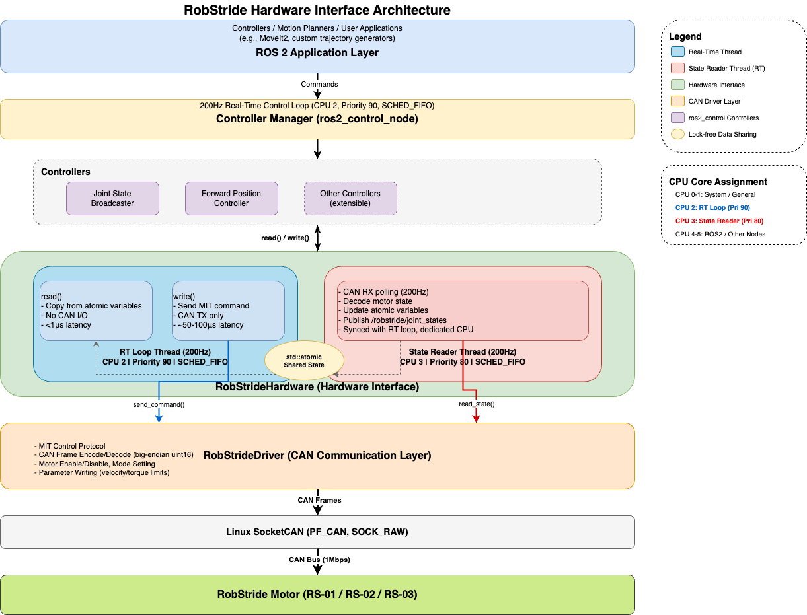

# robstride_hardware 詳細

## 1. 実際のスコープ

このパッケージは現在、RS02 を 1 軸だけ接続した最小系を対象にしています。`robstride_system.urdf.xacro` の関節は `joint1` だけであり、10 軸の BSL-Droid 全身ハードウェア設定はまだ入っていません。

## 2. 現在の構成

| 要素 | 実体 | 補足 |
|---|---|---|
| ドライバ | `robstride_driver.*` | SocketCAN と MIT コマンド送受信 |
| Hardware Interface | `RobStrideHardware` | `ros2_control` の `SystemInterface` |
| URDF | `urdf/robstride_system.urdf.xacro` | `joint1` の単関節モデル |
| コントローラ設定 | `config/controllers.yaml` | `forward_position_controller` も `joint1` だけ |
| launch | `bringup.launch.py` | 単関節 bringup |
| launch | `demo_sinusoidal_motion.launch.py` | 正弦波の目標位置を送るデモ |

## 3. 制御構成

- Controller Manager の RT ループは 200 Hz
- State reader thread も既定 200 Hz
- State reader thread は CAN 読み出しと `/robstride/joint_states` publish を担当
- RT ループ側の `read()` は atomic 変数のコピーだけに絞っている

## 4. 現在の制約

- Linux / SocketCAN 前提です
- 単関節 `joint1` だけを想定しています
- BSL-Droid 10 軸全体のハードウェア統合ではありません
- ドキュメントは本ファイルに集約し、以前の詳細分割文書は削除しました

## 5. 参考図

起動コマンドはプロジェクトルートの `README.md` を参照してください。
