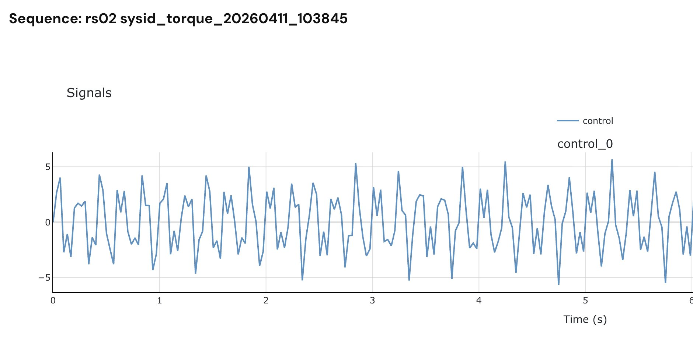
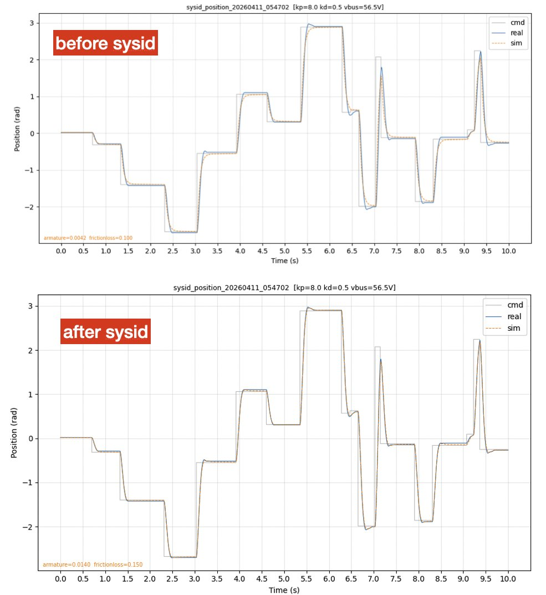
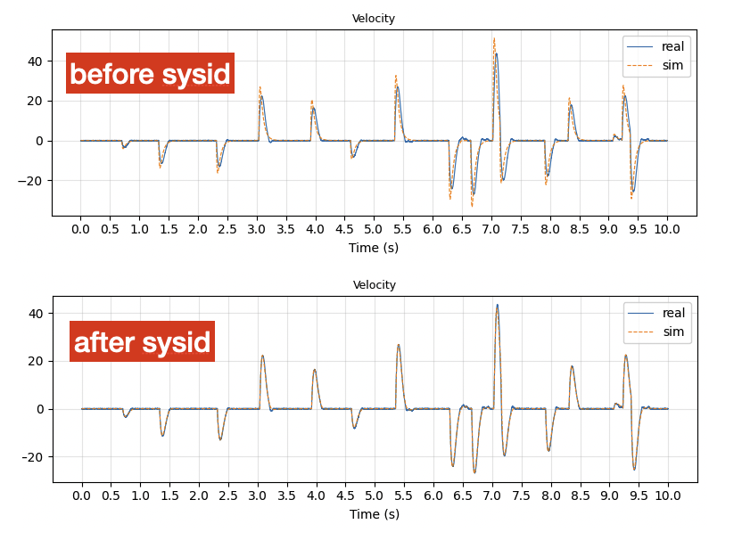

## 出典

https://x.com/observie/status/2043636045200162876 を和訳してmarkdown形式に落とし込んだものです．

## 概要

システム識別（sysid）とは、シミュレーションが現実と一致するようにする物理パラメータを見つけ出すプロセスです。シミュレーション内でRLの移動ポリシーを訓練している場合、モータモデルの精度がポリシーの実ロボットへの転送性能に直接影響します。

[@kevin_zakka](https://x.com/kevin_zakka)による最近のgitコミットでは、MuJoCoにsysidツールボックスが追加され、このプロセスを自動化するようになりました：記録されたモータデータとMuJoCoモデルを提供するだけで、シミュレーションと実測の軌跡の差を最小化するようにモデルパラメータを最適化します。

## 同定手順

RS02 QDDモータ（ピーク17 Nm、ギア比7.75:1）に対して、私はRustツールを作成し、1 kHzでマルチサイントルク励振を送り、位置/速度フィードバックを記録します。その後、このデータをMuJoCoのsysidオプティマイザに投入します。

モータパラメータを特定するためには、異なる周波数で異なる物理的効果を励起する必要があります： 
高周波：モータが急速に方向を反転します。反射されたロータ慣性（電機子）がこれらの高速加速度に抵抗します。 
低周波：モータがゆっくりと動き、方向を徐々に反転します。慣性抵抗が減少し、摩擦が支配的になります。 単一周波数正弦波では1つの領域しか励起できないため、システム同定の標準的な手法として、1回の記録ですべてを励起するために複数の周波数の和を使用しています： torque(t) = amp × (sin(2π·f·t) + 0.6·sin(2π·3.4f·t) + 0.3·sin(2π·7.4f·t)) 周波数は互いに打ち消し合わないよう非有理数比で選ばれています。振幅は高周波になるほど減少します。基本周波数と振幅が重要であることがわかりました。周波数が低すぎるか振幅が高すぎると、モータが速度を蓄積し、トルク-速度曲線に達します。周波数が高すぎるか振幅が低すぎると、摩擦を特定できるほどの運動が不足します。私のRS02の場合、2-3 Nmの振幅で4-5 Hzの基本周波数が最適でした。 （mujoco sysid toolboxで生成されたプロット）
   
各 sysid 記録は、1 Mbps の CAN バス上で 1 kHz で動作します。毎ミリ秒、トルクコマンド（8 バイト + 29 ビットの拡張 ID）を送信し、約 100 us 後にモーターがフィードバック応答の送信を開始します：位置、速度、推定トルク、および温度。 コマンド + 応答のハンドシェイク全体は約 300 us かかり、1 ms のスロットに容易に収まります。 純粋なトルクコマンド（kp=0, kd=0）を送信しているので、モーターは内部の PD コントローラーが識別しようとしている物理現象をマスキングすることなく、励起信号を適用します。 各記録は、10 秒間（設定可能）の 10,000 のタイムスタンプ付きサンプルを含む CSV を生成します。

MuJoCoのsysidツールボックスはグレイボックス識別を行います：モデル（MuJoCo XML）と記録された軌道データを供給すると、最適化器が未知として指定したパラメータを見つけます。 同じトルクコマンドをシミュレートされたモーターを通して再生し、予測位置/速度を実際の記録と比較します。パラメータは次に、差を最小限に抑えるために反復的に調整されます。 私はトルクアクチュエータ付きの単一ヒンジジョイントの最小MuJoCoモデルを使用し、識別する3つのパラメータをマークしました： 
armature: ギアボックスを通した反射ロータ慣性 
frictionloss: クーロン摩擦、運動に反対する定数トルク 
damping: 粘性摩擦、速度に比例 
以下の例では、2つの10秒マルチサイン軌道を使用し、最適化器は16回の反復（数秒）で収束します。残差は52.7から0.036に低下し、シミュレーションが今や実際のモーターの軌道に密接に従う強い兆候です。

## 評価

識別されたパラメータを検証するため、別途テストを実施しました。RS02にランダムな位置コマンドを送信し、PDコントローラ（kp=8, kd=0.5）で構成して、10秒間、1 kHzのレートでモーターの位置と速度を記録しました。モーターは±π radの間でランダムなターゲットにジャンプし、そのPDコントローラが位置を追跡します。 次に、同じ位置コマンドを、同じKp/Kdで構成されたMuJoCoアクチュエータモデルに供給し、初期のアーマチュアと摩擦損失パラメータ、およびフィットしたパラメータの両方を使用して比較しました。 調整されたパラメータを使用することで、sim2realのギャップが目に見えて減少していることがわかります。sysid前（上図）では、シミュレーション（橙色の破線）が各ステップで実機モーター（青色）をオーバーシュートし、ターゲットに到達する速度が速すぎます。低慣性がシミュレーションされたモーターを過度に反応的にしています。sysid後（下図）では、シミュレーションと実機がほぼ区別がつきません。

速度比較により、より詳細な情報が明らかになります。sysid前（上図）では、シミュレーション速度が実機モーターをオーバーシュートします：シミュレーションモーターが過小評価された慣性により、加速が強すぎるためです。sysid後（下図）では、速度トレースはほぼ同一です。
